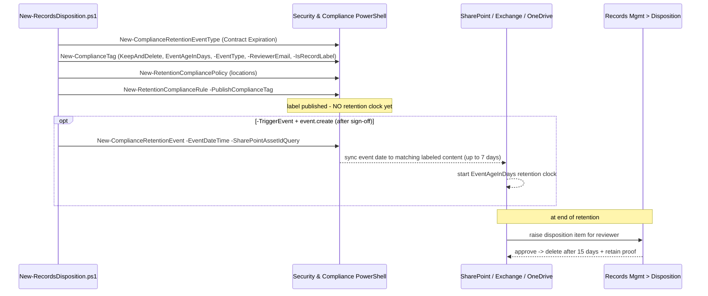

## 1. Problem statement

Many records obligations are anchored to a **business event**, not the age of a file: "retain contract
records for 7 years **after the contract expires**", "retain employee records for 10 years **after
separation**". The start date isn't known when the content is created, so a creation/modification-age
clock can't express the rule. And because disposal of a declared record has legal weight, it should be a
**reviewed, evidenced** act — not a silent automatic delete. This scenario builds that lifecycle as
code: an **event type**, an **event-based record label** (`EventAgeInDays`, `KeepAndDelete`) that ends
in a **disposition review**, a policy that **publishes** the label, and a **gated** trigger event that
starts the clock only on explicit, signed-off action.

## 2. Design goals

1. **Model the real obligation.** Event-anchored retention (`EventAgeInDays` + an event type), not
   age-based — the only correct expression of "N years after X happens".
2. **Reviewed disposal, with proof.** `KeepAndDelete` + `-ReviewerEmail` so disposal is a records
   manager's approved decision and the system keeps proof of disposition.
3. **Start no clock by accident.** Building the type/label/policy starts nothing; the irreversible event
   is created only with `-TriggerEvent` **and** `event.create=true`, after sign-off.
4. **Reproducible and auditable.** The config file is the versioned records schedule an examiner wants.
5. **Idempotent create-or-report.** Locate objects by name; never silently mutate a records object.
6. **Honest about irreversibility and latency.** A triggered event can't be cancelled; an applied record
   label can't be deleted; publish/sync take up to 7 days — all documented, not glossed.

## 3. Why event-based retention + disposition review (not the DLM regulatory scenario)

- **Creation-age retention** (the DLM [`data-lifecycle-management/retention-labels-financial-records`](/scenarios/data-lifecycle-management/retention-labels-financial-records/)
  scenario) starts the clock when content is created — right for "keep books and records 7 years", wrong
  for "keep 7 years **after** an event" whose date is unknown at creation.
- **Auto-apply** stamps a label on matching content; **publishing** offers the label for deliberate
  application (by users, or as a default library label). Records whose disposal is reviewed are usually
  *declared* deliberately, so publish is the idiomatic fit here.
- **Regulatory record** (DLM scenario) is maximum immutability with **automatic** delete; a **record
  label with disposition review** keeps the record lockable but ends in a **human-approved** disposal
  with proof — the records-management disposition lifecycle. Different obligation, complementary control.

## 4. Object model and sequence

The type/label/publish steps are inert with respect to live retention; only a triggered event starts a
clock, and disposal is review-gated at the end.

## 5. Key decisions

| Decision | Choice | Rationale |
|---|---|---|
| Clock | `EventAgeInDays` + event type | Only correct model for "N years after an event" |
| Action | `KeepAndDelete` | Retain, then dispose (vs. Keep-forever or delete-only) |
| Disposal | Disposition review (`-ReviewerEmail`) | Reviewed, evidenced disposal of records |
| Record flag | `-IsRecordLabel $true` | Declares content a record (lockable) without full regulatory immutability |
| Application | **Publish** (`-PublishComplianceTag`) | Deliberate/record declaration vs. auto-apply |
| Event | Gated `-TriggerEvent` + `event.create` | Triggering is irreversible — never a side effect |
| Event scope | Asset-ID query in config | Prevent an event from retaining *all* event-type-labeled content |
| Idempotency | Create-or-report by name | Never silently mutate a records object |
| Dry-run | Custom `-DryRun` | `-WhatIf` is non-functional in S&C PowerShell |

## 6. Failure modes and guardrails

| Failure mode | Guardrail |
|---|---|
| Accidental clock start | Event only on `-TriggerEvent` **and** `event.create=true`; deploy default starts nothing |
| Over-broad event | Config ships an asset-ID query; script warns loudly if none is set |
| Silent mutation of a records object | Create-or-report; existing objects reported, never modified |
| Irreversible delete via rollback | Rollback disables by default; `-Delete` only *attempts* label/event-type removal and reports (never forces) failures for applied records |
| No disposition review (silent auto-delete) | Script + validate warn when `reviewerEmail` is empty |
| Latency mistaken for failure | 7-day publish/sync documented in README §7/§11 and script output |
| Reviewers can't see items | RBAC note: Disposition Management role required, not granted to admins by default |

## 7. Non-goals

- **The full file plan** (retention schedule with citations, departments, disposition authorities across
  many record classes) — this builds one representative event-based class; bulk creation via the
  documented CSV import is a follow-up.
- **Multi-stage disposition panels** beyond noting support (5 stages / 10 reviewers) — the starter uses
  a single reviewer set; `-MultiStageReviewProperty` / `-ComplianceTagForNextStage` model chains.
- **Graph-based event automation** — events here are created via PowerShell; wiring a business system to
  fire events via the Microsoft Graph records-management APIs is a documented extension [[Graph]](../README.md#12-references).
- **Adaptive scopes** for the publish policy — static locations here; large/dynamic estates use adaptive
  scopes (a follow-up).
- **Regulatory (WORM) immutability** — covered by the sibling DLM scenario; this uses a lockable record
  label with reviewed disposition instead.
- **Editing an existing schedule in place** — the deploy reports and does not mutate; changes are a
  deliberate, reviewed action, and the event type is immutable once a label references it.
