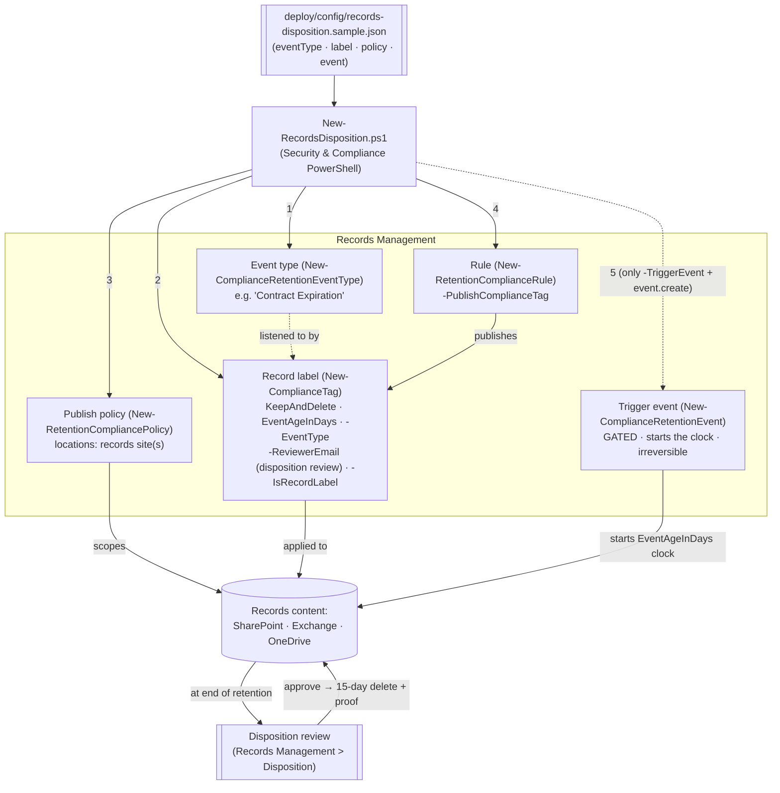

## 1. Scenario summary

Builds the full **records-management disposition lifecycle** as code: an **event type** (e.g. "Contract
Expiration"), an **event-based record label** whose retention clock starts on that event and ends in a
**disposition review** rather than an automatic delete, a policy that **publishes** the label so it can
be applied, and — gated behind an explicit switch and sign-off — the **trigger event** that starts a
real retention clock. This is the *retain-until-event → review → dispose* pattern that records managers
need for records whose life is defined by a business event, not by the age of the file.

**Who it's for:** a records-management / compliance team at a regulated organization that must retain
records for a fixed period **after a business event** (a contract expiring, an employee leaving, a
product reaching end-of-life) and then dispose of them through a **reviewed, evidenced** process — with
the whole lifecycle defined as reproducible, auditable code.

**How it differs from the DLM regulatory-retention scenario** (`scenarios/data-lifecycle-management/retention-labels-financial-records/`):
that one uses a **regulatory record** label with a **creation-age** clock and **auto-applies** it; this
one uses an **event-based** clock (`EventAgeInDays`), a **`KeepAndDelete`** action with a **disposition
review**, and **publishes** the label for controlled application. Different obligation, different
lifecycle — deliberately complementary, not a duplicate.

## 2. Business/regulatory driver

Many retention obligations are **event-anchored**, not age-anchored: "retain contract records for 7
years **after the contract expires**", "retain employee records for 10 years **after separation**",
"retain product specs until **end-of-life** plus 5 years". You cannot express these with a
creation/modification-age clock — the start date isn't known when the content is created. Microsoft
Purview **event-based retention** models exactly this: a label listens for an **event type**, and when a
dated **event** is created the retention period begins for the matching content [[1]](#references).

Because these records are usually **declared records** and their disposal has legal weight, best
practice is to end retention with a **disposition review** — a records manager (or a multi-stage panel)
**reviews and approves** disposal, and the system keeps **proof of disposition** [[2]](#references).
That reviewed, evidenced disposal is what regulators and auditors ask to see. **DoD 5015.02**,
**SEC 17a-4 / FINRA 4511** (records schedules), **GDPR/CCPA** storage-limitation, and internal records
schedules all point at this lifecycle. Managing it as code makes the schedule reproducible and the
disposition defensible.

> ⚠️ **Two irreversible edges.** (1) A **triggered event cannot be cancelled** — deleting the event does
> not stop retention it already started. (2) A **record label that has been applied cannot be deleted**
> and its retention cannot be shortened. So the trigger event is gated (`-TriggerEvent` **and**
> `event.create=true`), and the deploy is create-or-report. Test in a lab tenant, review with `-DryRun`,
> and get Records/Legal sign-off. See §11.

## 3. Prerequisites

Full licensing detail: `docs/licensing-matrix.md`. RBAC: `docs/rbac-model.md`. Automation surface:
`docs/automation-surface.md` (surface 1 — Security & Compliance PowerShell). Summary:

| Requirement | Minimum | Notes |
|---|---|---|
| Licensing | **Records management** (record labels, event-based retention, disposition review): **M365 E5 / E5 Compliance / Purview Suite** | Event-based retention + disposition are E5 records-management capabilities [[7]](#references) |
| Role (config) | **Records Management** or **Retention Management** role group | To create event types, labels, policies, rules — `docs/rbac-model.md` |
| Role (disposition) | **Disposition Management** role (in the Records Management role group; **not** granted to global admins by default) | Reviewers need this to see and act on disposition items [[2]](#references) |
| Reviewers | Individual **users** or **mail-enabled security groups** (not Microsoft 365 Groups) | Up to 10 reviewers/stage, up to 5 stages [[2]](#references) |
| Auth | `Connect-IPPSSession` (certificate app-only preferred) | Security & Compliance PowerShell — `docs/automation-surface.md` §3 |
| Target locations | SharePoint site(s) / mailboxes / OneDrive | Publish policy needs ≥1 location |

> Verify current entitlement names against `docs/licensing-matrix.md` (dated 2026-09-02) before a sales
> commitment — SKU names change.

## 4. Architecture



Five objects, staged so nothing starts a clock by accident: the **event type** and **label** define the
schedule, the **policy+rule** publish the label, and the **event** (gated) starts retention. Disposal at
the end is a **reviewed** step. Full rationale: `design.md`.

## 5. Step-by-step implementation

```powershell
# Connect (certificate app-only preferred - docs/automation-surface.md §3)
Connect-IPPSSession -AppId $AppId -Certificate $Cert -Organization 'contoso.onmicrosoft.com'

# 1. Dry run - prints the exact cmdlets, starts nothing
./deploy/New-RecordsDisposition.ps1 -ConfigPath ./deploy/config/records-disposition.json -DryRun

# 2. Build event type + label + publish policy/rule (NO clock started)
./deploy/New-RecordsDisposition.ps1 -ConfigPath ./deploy/config/records-disposition.json

# 3. Validate
./validate/Test-RecordsDisposition.ps1 -ConfigPath ./deploy/config/records-disposition.json

# 4. LATER, for a real dated event only (irreversible) - requires event.create=true in config:
./deploy/New-RecordsDisposition.ps1 -ConfigPath ./deploy/config/records-disposition.json -TriggerEvent
```

### Portal reference

Event types and events live in the [Microsoft Purview portal](https://purview.microsoft.com) under
**Records Management → Events** (**Manage event types** / **+ Create** event) [[1]](#references); labels
and label policies under **Records Management → File plan / Label policies**; pending disposals under
**Records Management → Disposition** [[2]](#references). Events can also be automated via the Microsoft
Graph records-management APIs (the older REST event API is deprecated) [[6]](#references). `-WhatIf` is
non-functional in S&C PowerShell, so the scripts ship a `-DryRun`.

## 6. Configuration reference

| Setting | Value this scenario uses | Notes |
|---|---|---|
| Event-type cmdlet | `New-ComplianceRetentionEventType` | Creates the event type [[5]](#references) |
| Label cmdlet | `New-ComplianceTag` | Record label [[4]](#references) |
| `RetentionAction` | `KeepAndDelete` | Retain, then dispose (review-gated) |
| `RetentionType` | `EventAgeInDays` | Clock starts on the event, not content age |
| `EventType` | the event-type name | Binds the label to the event type; **can't be changed after save** [[1]](#references) |
| `RetentionDuration` | `2555` (≈7 years) | Days after the event |
| `IsRecordLabel` | `$true` | Declares content a record (lockable) |
| `ReviewerEmail` | records-manager address(es) | Enables **disposition review**; users or mail-enabled security groups [[2]](#references) |
| `AutoApprovalPeriod` | optional | Auto-approve if no reviewer acts within N days (7–365) [[4]](#references) |
| Publish cmdlets | `New-RetentionCompliancePolicy` + `New-RetentionComplianceRule -PublishComplianceTag` | Publish (not auto-apply) [[3]](#references) |
| Event cmdlet | `New-ComplianceRetentionEvent` | `-EventDateTime`, `-SharePointAssetIdQuery`/`-ExchangeAssetIdQuery` to scope [[8]](#references) |

Exact cmdlet syntax and Learn sources are cited in each script's `.NOTES`.

## 7. Validation / how to prove it works

1. **Automated** — `./validate/Test-RecordsDisposition.ps1` confirms the event type exists; the label
   exists as a record with `KeepAndDelete` / `EventAgeInDays`, is bound to the event type, and has a
   disposition reviewer; the publish policy exists, is enabled, has ≥1 location; the rule publishes the
   label; and reports any already-triggered events. Exits non-zero on failure.
2. **Publish test** — apply the published label to a test item (or set it as a default library label);
   confirm it appears (portal, or the item's compliance tag). Publishing can take up to **7 days**.
3. **Event / clock test (lab tenant)** — create a dated event (`-TriggerEvent`) scoped by asset ID, and
   confirm the retention clock starts for matching labeled content (sync up to 7 days) [[1]](#references).
4. **Disposition test (lab tenant)** — for a short test duration, let retention elapse and confirm a
   **disposition item** appears in **Records Management → Disposition** for the reviewer, that approval
   moves it toward deletion (**15 days** after approval), and that **proof of disposition** is retained
   [[2]](#references).
5. **Idempotency proof** — re-run the deploy; every object reports `exists` (not `created`); nothing is
   duplicated or silently mutated; no event is created without `-TriggerEvent` + `event.create`.
6. **Evidence export for an auditor/examiner** —
   `scenarios/records-management/disposition-proof-export/` documents the portal's own Filter+Export
   `.csv` workflow for this evidence and adds a scriptable, schedulable rolling audit trail
   (`Search-UnifiedAuditLog` against the disposition-review and record-deletion Operations) as a
   companion to the manual per-label export above.

## 8. Operations & tuning

**KPIs / signals:** publish policy **DistributionStatus** (should reach a healthy state); **disposition
backlog** (pending items awaiting review — the key records-management SLA); count of events triggered
vs. expected; count of items disposed with proof. **Tuning:** scope each event **narrowly** with an
asset-ID query — an event with no asset ID starts retention for **all** content carrying that
event-type label, which is almost never intended [[1]](#references). Use `AutoApprovalPeriod` to stop a
disposition backlog stalling disposal when reviewers are slow, but only where auto-approval is
defensible for that record class. Multi-stage reviews (up to 5 stages, 10 reviewers each) model
sign-off chains where one approver isn't enough.

**Change management:** the config file is the versioned records schedule — treat any change to the label,
event type, or reviewers as a controlled, Records/Legal-reviewed change. The event type **cannot be
changed** once a label is saved with it, so name and scope it deliberately.

## 9. Rollback / decommission

See `rollback.md`. Quick reference: `./deploy/Remove-RecordsDisposition.ps1` **disables** the publish
policy (stops the label being newly applied); `-Delete` removes the policy + rule and **attempts** to
remove the label and event type. Rollback **cannot** delete a record label already applied, shorten
retention, or **cancel a triggered event** — those are irreversible by design, and the script reports
rather than forces them.

## 10. Cost & licensing notes

- **Per-user E5 entitlement**, no Azure consumption meter. Event-based retention, record labels, and
  disposition review are **E5 / E5 Compliance / Purview Suite** records-management capabilities
  [[7]](#references).
- **Cost is licensing + storage + records-management labor.** Records held until an event (which may be
  years away, or indefinite if the event never fires) accrue storage; and disposition **review** is
  human effort — budget reviewer time, or use auto-approval where defensible.
- **The expensive mistake is a mis-scoped event.** An event without an asset-ID query starts retention
  across everything carrying that event-type label — a broad, hard-to-unwind action (§11).

## 11. Known limitations & gotchas

- **A triggered event can't be cancelled.** Deleting the event does **not** stop the retention it
  started; there's no undo. The trigger is gated behind `-TriggerEvent` **and** `event.create=true`, and
  the deploy without those flags starts **no** clock [[1]](#references).
- **An applied record label can't be deleted** and its retention can't be shortened — rollback reports
  this rather than forcing it. Confirm you need a *record* label (lockable) vs. a standard retention
  label before declaring records.
- **The event type is immutable after the label is saved with it** — name/scope it deliberately.
- **Event scope is dangerous by default.** An event with no `-SharePointAssetIdQuery` /
  `-ExchangeAssetIdQuery` triggers retention for **all** content with that event-type label
  [[1]](#references). The sample config ships an asset-ID query and `create=false`.
- **`-WhatIf` is non-functional in S&C PowerShell** — the scripts ship a `-DryRun` instead.
- **Latency.** Publishing a label and syncing a triggered event to content each take **up to 7 days** —
  don't mistake latency for failure.
- **Disposition RBAC is separate.** The **Disposition Management** role isn't granted to global admins by
  default; reviewers must hold it, or they won't see disposition items [[2]](#references). Reviewers are
  users or mail-enabled security groups, not Microsoft 365 Groups.
- **Idempotency is create-or-report, not create-or-update.** Records objects are high-consequence and are
  never silently mutated — edit deliberately, with review.
- **Events are now automated via Microsoft Graph** (records-management APIs); the earlier REST event API
  is deprecated. PowerShell `New-ComplianceRetentionEvent` remains supported [[6]](#references).
- **Illustrative values.** The event-type name, 7-year duration, site URL, reviewer address, and
  asset-ID query are placeholders — set them to your real records schedule, validated by Records/Legal,
  before deploying.

## 12. References

1. Start retention when an event occurs (event-based retention: event types, events, asset-ID scoping, can't-cancel, PowerShell + Graph automation) — <https://learn.microsoft.com/purview/event-driven-retention>
2. Disposition of content / disposition reviews (Disposition Management role, reviewers, stages, 15-day post-approval delete, proof of disposition) — <https://learn.microsoft.com/purview/disposition>
3. Automatically apply / publish a retention label (publish vs. auto-apply, latency, RetryDistribution) — <https://learn.microsoft.com/purview/create-apply-retention-labels>
4. New-ComplianceTag (retention label; RetentionAction/Type, EventType, ReviewerEmail, IsRecordLabel, AutoApprovalPeriod) — <https://learn.microsoft.com/powershell/module/exchangepowershell/new-compliancetag>
5. New-ComplianceRetentionEventType — <https://learn.microsoft.com/powershell/module/exchangepowershell/new-complianceretentioneventtype>
6. Use the Microsoft Graph records management APIs (event automation; REST event API deprecated) — <https://learn.microsoft.com/graph/api/resources/security-recordsmanagement-overview>
7. Microsoft Purview service description — Records Management licensing — <https://learn.microsoft.com/office365/servicedescriptions/microsoft-365-service-descriptions/microsoft-365-tenantlevel-services-licensing-guidance/microsoft-purview-service-description>
8. New-ComplianceRetentionEvent (-EventDateTime, -SharePointAssetIdQuery / -ExchangeAssetIdQuery, -EventType) — <https://learn.microsoft.com/powershell/module/exchangepowershell/new-complianceretentionevent>
9. Learn about records management — <https://learn.microsoft.com/purview/records-management>
10. New-RetentionComplianceRule (-PublishComplianceTag) — <https://learn.microsoft.com/powershell/module/exchangepowershell/new-retentioncompliancerule>

> Re-verify all links, cmdlet parameters, licensing, disposition RBAC, and the irreversibility behaviors
> against current Microsoft Learn before a customer-facing deployment. Triggered events and applied
> record labels are irreversible — the scenario is deliberately conservative (dry-run, gated event,
> create-or-report, no force-removal of records).
