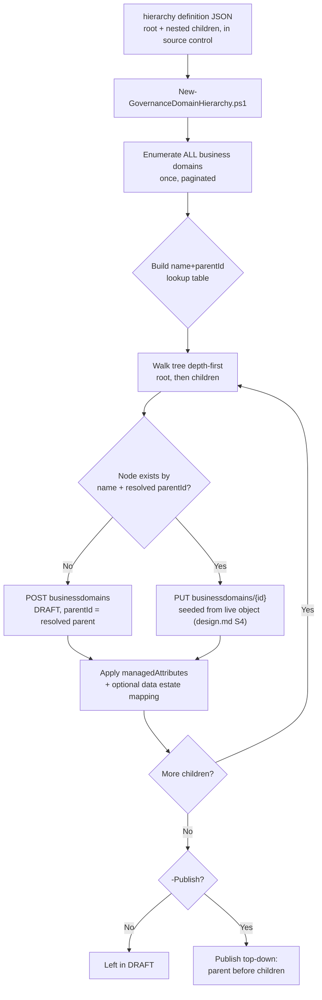

## 1. Scenario summary

Stands up a multi-level Microsoft Purview Unified Catalog **governance domain hierarchy** — a
parent domain with nested child (and grandchild) domains, each carrying its own admin-defined
business-concept attribute values and an optional recommended Data Map collection ("data estate
mapping") — from a single declarative JSON file, with one idempotent deploy script instead of one
domain per portal session. This extends `scenarios/unified-catalog/curate-business-glossary/`,
which deliberately scoped itself to a single standalone domain and named this exact
gap — multi-domain hierarchies, custom attributes, data estate mappings — as a follow-up (§11 of
that scenario, `PROGRESS.md`).

**Who it's for:** a data governance team past the single-domain pilot stage, federating governance
across business units (Corporate → Sales → Sales-EMEA is this scenario's own worked example,
mirroring Microsoft's own sample data-governance walkthrough §11) who wants the domain tree defined
and reviewed as a pull request, not built one portal click at a time by whoever remembers the
intended shape.

## 2. Business/regulatory driver

Governance domain hierarchies are how Unified Catalog **federates** governance responsibility
across business units while keeping enterprise-wide concepts centrally owned — Microsoft's own
guidance names this "key points of federation for collaboration and governance in your
organization" [[8]](#12-references). A domain tree, not a flat list of unrelated domains, is what
lets:
- A **Corporate**-level domain hold enterprise-wide, universally-shared business concepts (a
  single `Customer` definition every business unit inherits context from), while
- **Line-of-business** child domains (`Sales`, `Marketing`) own their own data products and terms
  without re-litigating the enterprise-wide ones, and
- **Regulatory-scoped** grandchild domains (`Sales - EMEA`, `isRestricted: true` in this scenario's
  worked example) ring-fence data-residency-sensitive concepts for a **GDPR** review without
  restructuring the whole tree.

This is a **governance-scaling driver**, same category as `curate-business-glossary`'s own §2, and
directly supports:
- **GDPR/data-residency segregation** — a restricted regional sub-domain is how this scenario
  models "this business concept's data stays regionally scoped," reviewable as a diff rather than a
  portal screenshot.
- **SOC 2 / ISO 27001 change-management evidence** — every domain, its attribute values, and its
  parent placement is a reviewable JSON diff in a pull request.
- **CDMC ownership/accountability controls** — business-concept attributes (§6 of `design.md`) are
  exactly the kind of structured, admin-governed metadata (e.g. a `Data Classification Tier`
  attribute this scenario's worked example sets per domain) CDMC control templates check for
  [[3]](#12-references) (same source `curate-business-glossary/README.md` §2 cites for this claim).

## 3. Prerequisites

Full licensing detail and citations: `docs/licensing-matrix.md`. Summary for this scenario:

| Requirement | Minimum | Notes |
|---|---|---|
| Unified Catalog data governance | **Pay-as-you-go (PAYG)**, billed on unique **governed assets/day** | See §10 — a domain tree with no data assets attached costs nothing, same as `curate-business-glossary` §10 |
| Azure subscription + resource group | Same tenant as the Purview account | Required to enable Purview PAYG billing at all [[5]](#12-references) |
| Role to create new domains | **Governance Domain Creator** (catalog-level role) | `docs/rbac-model.md` §5 |
| Role to edit/re-run against existing domains | **Governance Domain Owner** (governance-domain-level role; assigned automatically to whoever creates the domain — `docs/rbac-model.md` §5) | Required to edit a domain (name, attributes, data estate mapping, status) per Microsoft's own guidance [[6]](#12-references) — distinct from the catalog-level **Governance Domain Creator** role needed only to make a *new* domain |
| Business-concept attribute *definitions* | Pre-created by a **Governance Domain Creator/Data Curator** admin in **Catalog management → Custom metadata (preview)**, scoped to include **Governance Domains** | Portal-only — this scenario only *sets values* for attributes that already exist (§11, `design.md` §6) |
| Target Data Map collection(s) (only if using `dataEstateMapping`) | Already registered in Data Map | This scenario does not create collections — see `design.md` §7 |
| Automation identity | App registration whose service principal is assigned the roles above | Client-credentials OAuth2 against resource `https://purview.azure.net` — `docs/automation-surface.md` §3 |

> Verify current entitlement and role names against `docs/licensing-matrix.md`/`docs/rbac-model.md`
> and the Product Terms before a sales commitment — SKU and role names change.

## 4. Architecture



One Unified Catalog domain tree, authored via the **Purview Unified Catalog REST API**
(`docs/automation-surface.md` surface 4) — the Business Domain operation group's `Enumerate`,
`Create`, `Update`, `Get`, and `Delete` operations. Unlike `curate-business-glossary`, this scenario
never calls Microsoft Graph — attribute values and data estate mappings need no external identity
resolution.

## 5. Step-by-step implementation

### Portal path (for a first manual walkthrough / to validate intent before scripting)

1. Sign in to the [Microsoft Purview portal](https://purview.microsoft.com) → **Unified Catalog** →
   **Catalog management** → **Governance domains** → **New Governance domain**.
2. Name: `Corporate`. Type: **Functional unit**. Leave **parent domain** blank. On **Custom
   attributes**, set `Data Classification Tier` = `Tier 1 - Enterprise-wide` (the attribute must
   already exist — see §3). **Create**.
3. **New Governance domain** again. Name: `Sales`. Type: **Line of business**. **Parent domain**:
   `Corporate`. Set the same attribute to `Tier 2 - Line of business`. **Create**. Repeat for
   `Marketing` (also parented to `Corporate`).
4. **New Governance domain** once more. Name: `Sales - EMEA`. Type: **Regulatory**. **Parent
   domain**: `Sales`. Set `Tier 3 - Regional/restricted`. Toggle domain **restricted** if your
   tenant exposes that control on this page. **Create**.
5. On each domain's **Data estate mappings** tab, use **Select a mapping** to associate the domain
   with its intended Data Map collection [[9]](#12-references).
6. **Publish** each domain, parent before children (a child cannot be published usefully before
   its own concepts are visible, and Microsoft requires the domain itself published before any
   business concept within it can be published [[7]](#12-references)).

### Script path (idempotent, parameterized, dry-run capable)

```powershell
# 1. Dry run - reports every domain that would be created/updated, makes no mutating call
./deploy/New-GovernanceDomainHierarchy.ps1 `
    -PurviewAccountEndpoint 'https://api.purview-service.microsoft.com' `
    -TenantId $TenantId -AppId $AppId -ClientSecret $ClientSecret `
    -HierarchyDefinitionPath './deploy/hierarchy/corporate-sales-marketing-hierarchy.json' -WhatIf

# 2. First real run - recommended to skip the data estate mapping until verified (Section 11)
./deploy/New-GovernanceDomainHierarchy.ps1 `
    -PurviewAccountEndpoint 'https://api.purview-service.microsoft.com' `
    -TenantId $TenantId -AppId $AppId -ClientSecret $ClientSecret `
    -HierarchyDefinitionPath './deploy/hierarchy/corporate-sales-marketing-hierarchy.json' `
    -SkipDataEstateMapping

# 3. After confirming data estate mapping behavior in a pilot tenant (Section 11), re-run without
#    -SkipDataEstateMapping to reconcile the mapping in too, then publish
./deploy/New-GovernanceDomainHierarchy.ps1 `
    -PurviewAccountEndpoint 'https://api.purview-service.microsoft.com' `
    -TenantId $TenantId -AppId $AppId -ClientSecret $ClientSecret `
    -HierarchyDefinitionPath './deploy/hierarchy/corporate-sales-marketing-hierarchy.json' -Publish

# 4. Validate
./validate/Test-GovernanceDomainHierarchy.ps1 `
    -PurviewAccountEndpoint 'https://api.purview-service.microsoft.com' `
    -TenantId $TenantId -AppId $AppId -ClientSecret $ClientSecret `
    -HierarchyDefinitionPath './deploy/hierarchy/corporate-sales-marketing-hierarchy.json'
```

The deploy script uses the Purview Unified Catalog REST API directly (`Invoke-RestMethod`) —
automation surface 4 per `docs/automation-surface.md` §1; there is no PowerShell cmdlet module for
Unified Catalog domain authoring today.

## 6. Configuration reference

| Object | Field | Source | Notes |
|---|---|---|---|
| Governance domain | `type` | `FunctionalUnit` \| `LineOfBusiness` \| `DataDomain` \| `Regulatory` \| `Project` | Descriptive only — no documented behavioral difference [[10]](#12-references) |
| Governance domain | `parentId` | Another domain's `id`, or omitted for a root domain | Up to **five levels of depth**, up to **200 domains**, tenant-wide [[10]](#12-references) — this script enforces the depth ceiling client-side (throws before calling the API) and only warns on the count ceiling, since server-side enforcement of either is unconfirmed (`design.md` §3, §11 below) |
| Governance domain | `isRestricted` | boolean | Sent only when the definition file's node includes it; omitted otherwise (not cleared on existing domains this scenario doesn't explicitly set it for) |
| Governance domain | `managedAttributes[].name`/`.value` | Must match an attribute **definition** an admin already created, scoped to include Governance Domains | This scenario only sets values — see §3, §11, `design.md` §6 |
| Governance domain | `domains[].relatedCollections[]` (this scenario's `dataEstateMapping` block) | Opt-in per node; omit to skip | **VERIFY** — undocumented field semantics, §11, `design.md` §5 |
| Governance domain | `status` lifecycle | `DRAFT` → `PUBLISHED` → `EXPIRED` | Same lifecycle as `curate-business-glossary`; this scenario's `-Publish` walks the tree top-down |

Full request/response shapes: `deploy/New-GovernanceDomainHierarchy.ps1`'s inline comments and
`.NOTES` block cite the exact Microsoft Learn REST reference pages for every operation used.

## 7. Validation / how to prove it works

1. **Automated check** — `./validate/Test-GovernanceDomainHierarchy.ps1` confirms every domain
   exists under its expected parent, with matching type/description/attribute values, and reports
   (without failing on) publish status and the data estate mapping's presence. Exits non-zero on
   any hard failure.
2. **Portal check** — Purview portal → Unified Catalog → **Governance domains** → confirm
   `Corporate` lists `Sales` and `Marketing` as children, and `Sales` lists `Sales - EMEA`.
3. **Attribute check** — open `Sales - EMEA`'s details page → **Custom attributes** → confirm
   `Data Classification Tier` = `Tier 3 - Regional/restricted`.
4. **Data estate mapping check (if not skipped)** — open each domain's **Data estate mappings**
   tab and confirm the intended Data Map collection is shown as mapped — this is the one check
   this scenario cannot fully automate with confidence given §11's disclosed ambiguity; treat the
   portal view as the source of truth over the validate script's WARN-level check.
5. **Publish check (after `-Publish`)** — Unified Catalog → **Discovery** → **Enterprise glossary**
   or the domain list itself should show `PUBLISHED` for every domain in the tree.

## 8. Operations & tuning

**Review-before-publish workflow:** same two-step `DRAFT` → `-Publish` discipline as
`curate-business-glossary` §8 — a domain in `DRAFT` is visible only to Data Stewards and Governance
Domain Owners, giving a human review point before a domain (and anything inside it) becomes visible
tenant-wide.

**Growing the tree without re-touching siblings:** because idempotency matches on
`(name, parentId)` rather than name alone (`design.md` §3), adding one new child domain to the
definition file and re-running only creates that one domain — every existing sibling and ancestor
is matched, seeded from its live state, and left with the same net content (barring a deliberate
attribute-value or description edit in the file).

**Domain sprawl toward the 200-domain / 5-level ceiling:** this script warns once the tenant-wide
domain count (from its own full `Enumerate` pass) is at or above 200, and refuses (throws) before
creating any node past depth 5. Track domain count as an operational metric once multiple business
units start self-service authoring — the whole point of a hierarchy is to delegate authoring
without needing a flat, ungoverned domain-per-team sprawl; a domain nearing the ceiling is a signal
to consolidate via deeper nesting under an existing parent rather than adding new siblings.

**Attribute-definition drift:** this scenario assumes the attribute names in its definition file
are already defined by an admin (§3). If an admin renames or expires an attribute definition after
this scenario's tree is deployed, the next deploy run's `managedAttributes` update will either fail
(a renamed attribute is a "not found" API error, not a script bug) or silently keep setting a value
for an expired attribute (Microsoft does not document expired-attribute write behavior). Re-run
`validate/Test-GovernanceDomainHierarchy.ps1` after any attribute-definition change in
**Custom metadata (preview)** to catch drift.

## 9. Rollback / decommission

See `rollback.md` for the full staged procedure (unpublish → purge, deepest-first). Quick
reference: `./deploy/Remove-GovernanceDomainHierarchy.ps1 -Unpublish` reversibly unpublishes the
whole tree, children before parents; add `-Purge` to permanently delete it, also children before
parents — Microsoft's own guidance requires subdomains be removed before their parent
[[6]](#12-references).

## 10. Cost & licensing notes

- **This scenario, by itself, costs nothing beyond base Purview PAYG enablement.** Same billing
  fact as `curate-business-glossary` §10: Unified Catalog's meter counts **governed assets** (a
  data asset actually linked to a governance concept), not domain, attribute, or mapping objects
  themselves [[4]](#12-references). A five-domain tree with zero linked data assets incurs **no
  PAYG charge**.
- **Cost activates later**, once a future scenario attaches an actual data asset (via a data
  product, critical data element, or glossary term) to one of these domains.
- **No per-user license required** — PAYG-only, same as `curate-business-glossary` §10
  (`docs/licensing-matrix.md` §2).

## 11. Known limitations & gotchas

- **Data estate mapping is recommended guidance, not an access-control boundary.** Microsoft states
  this directly: the mapping is "meant to be recommended guidance, as these Data Governance roles
  require Data Map permissions to access the data assets" [[9]](#12-references). Mapping
  `Sales - EMEA` to a `sales-emea` collection does **not** by itself prevent a Data Steward assigned
  to that domain from browsing or curating assets in an entirely different, unmapped collection —
  that boundary is enforced (if at all) by the separate Data Map collection-role assignments
  (`docs/rbac-model.md` §5), not by this scenario's mapping. Do not present a data estate mapping to
  a buyer as a data-access restriction; it is a discovery/wayfinding aid for stewards and product
  owners only.
- **VERIFY — data estate mapping field semantics are this build's own inference, not a documented
  mapping.** The `domains[].relatedCollections[].parentCollection.refName` construction this
  scenario's `-SkipDataEstateMapping`-gated feature sends is inferred from field naming and
  nesting, not stated outright by Microsoft's REST reference — whose own worked examples for this
  specific nested object use meaningless placeholder strings, unlike the rest of the same request
  body (`design.md` §5 has the full comparison). **Default to `-SkipDataEstateMapping` on a first
  pilot-tenant run** and confirm the resulting state on the portal's **Data estate mappings** tab
  before trusting a scripted mapping in production.
- **Business concept attribute *definitions* are portal-only.** This scenario can only set values
  for attributes an admin already created and scoped to Governance Domains — sending an undefined
  attribute name fails at the API, by design (§3, `design.md` §6). The unusual `isRequired` field
  living on each attribute *value* (rather than only its definition) in Microsoft's own schema is
  disclosed, not resolved, in `design.md` §6.
- **VERIFY — whether the 200-domain / 5-level ceilings are server-enforced or documentation-only
  guidance.** This script enforces the depth ceiling client-side (throws before any API call past
  depth 5) and only warns, non-fatally, on the count ceiling — confirm actual server-side behavior
  in a pilot tenant before assuming either is a hard backstop.
- **Business Domain Create/Update "required" fields, inherited from `curate-business-glossary`'s
  own disclosed VERIFY.** The formal REST reference marks `systemData`/`thumbnail`/`domains`/
  `managedAttributes` as "Required" in a way that contradicts ordinary REST semantics and
  Microsoft's own worked examples. This scenario's scripts always send `managedAttributes` and
  `domains` (as `@()` when empty) but never `systemData`/`thumbnail` — confirm against a pilot
  tenant if an API instance rejects that shape.
- **`-WhatIf` still performs a live, read-only `Enumerate` pass.** Exactly like
  `curate-business-glossary`'s own Query Terms behavior — the full-tenant existence check is not
  gated behind `ShouldProcess`, so a `-WhatIf` run still requires a reachable tenant and a valid
  token; only the mutating POST/PUT calls are suppressed.
- **`Enumerate` has no documented page-size parameter.** This build could not confirm the page size
  or total call count a very large tenant's full enumeration would need — `design.md` §3.
- **This scenario does not create the attribute definitions, the target Data Map collections, or
  domain role assignments (Data Steward/Data Product Owner on each new domain's Roles tab).** All
  three are manual, portal-only follow-ups — `design.md` §7 has the full non-goal list.
- **Publish ordering (parent before children) is this script's own design choice, not a documented
  requirement for domains specifically.** Microsoft only documents that a domain must itself be
  published before *business concepts within it* (terms, data products) can be published
  [[7]](#12-references) — it does not state whether publishing a child domain before its parent is
  rejected, silently allowed, or produces a confusing intermediate state. This script always
  publishes top-down as the conservative default; confirm actual behavior in a pilot tenant if a
  buyer's process requires publishing out of that order.

## 12. References

1. Create and manage business concept attributes (preview) — attribute groups, field types,
   scope, portal/admin-only definitions — <https://learn.microsoft.com/purview/unified-catalog-attributes-business-concept>
2. Custom metadata (preview) in Unified Catalog — <https://learn.microsoft.com/purview/unified-catalog-custom-metadata>
3. Disaster recovery for Unified Catalog (manual) — CDMC control templates — <https://learn.microsoft.com/purview/unified-catalog-disaster-recovery>
4. Learn about data governance billing (governed assets, what counts) — <https://learn.microsoft.com/purview/data-governance-billing>
5. Learn about Microsoft Purview billing models (PAYG, Azure subscription prerequisite) — <https://learn.microsoft.com/purview/purview-billing-models>
6. Create and manage governance domains — "Delete governance domains" (unpublish + delete
   subdomains first), "Configure data estate mappings", "Manage governance domains" (edit requires
   the governance domain owner role) — <https://learn.microsoft.com/purview/unified-catalog-governance-domains-create-manage>
7. Create and manage governance domains — "Create governance domains" (parent domain selection,
   200-domain/5-level ceiling, publish-domain-before-concepts requirement) — <https://learn.microsoft.com/purview/unified-catalog-governance-domains-create-manage#create-governance-domains>
8. Sample setup for data governance — Corporate/Sales worked example, "key points of federation" — <https://learn.microsoft.com/purview/data-governance-setup-sample>
9. Create and manage governance domains — "Configure data estate mappings" — <https://learn.microsoft.com/purview/unified-catalog-governance-domains-create-manage#manage-governance-domains>
10. Governance domains in Unified Catalog — domain types, 200-domain/5-level hierarchy limit — <https://learn.microsoft.com/purview/unified-catalog-governance-domains>
11. Purview Unified Catalog REST API — Business Domain operation group (Create/Update/Delete/Get/Enumerate) — <https://learn.microsoft.com/rest/api/purview/purview-unified-catalog/business-domain?view=rest-purview-purview-unified-catalog-2026-03-20-preview>
12. Unified Catalog API (Public Preview) overview — documented resource list (no Attributes
    resource), GA-only coverage, preview API versions — <https://learn.microsoft.com/rest/api/purview/unified-catalog-api-overview>
13. Data governance roles and permissions in Microsoft Purview — Governance Domain Creator/Owner,
    Data Steward — <https://learn.microsoft.com/purview/data-governance-roles-permissions>
14. Tutorial: Authenticate for APIs — service principal setup, Unified Catalog role assignment,
    client-credentials token flow — <https://learn.microsoft.com/purview/data-gov-api-rest-data-plane>
15. Microsoft identity platform and the OAuth 2.0 client credentials flow — <https://learn.microsoft.com/entra/identity-platform/v2-oauth2-client-creds-grant-flow>
16. Data governance billing frequently asked questions — unattached domains aren't charged — <https://learn.microsoft.com/purview/data-governance-billing-faq>

> Re-verify all links against current Microsoft Learn before a customer-facing engagement — this
> scenario targets Unified Catalog's **preview** REST API surface (`2026-03-20-preview`), which
> Microsoft explicitly documents as covering only GA Unified Catalog features and subject to
> change before general availability [[12]](#12-references).
