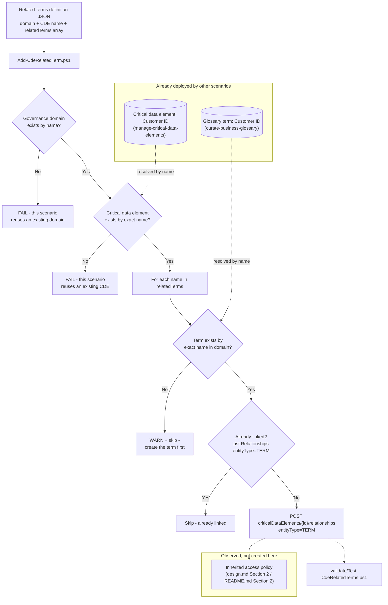

## 1. Scenario summary

Links an existing Microsoft Purview Unified Catalog **critical data element (CDE)** to one or
more existing **glossary terms** — the "Manage related terms" portal action — so a technical
governance object (the CDE, which maps physical columns) and a business-vocabulary object (the
term, which defines what those columns *mean*) point at each other. This is the small, targeted
companion `scenarios/unified-catalog/manage-critical-data-elements/design.md` §7 named as a
non-goal to keep that fragment scoped to column-mapping: linking terms reuses the identical
Create Relationship operation that scenario already calls for `entityType=DATACOLUMN`, just with
`entityType=TERM` instead, and the term-resolution code already exists verbatim in
`scenarios/unified-catalog/manage-data-products/deploy/New-DataProduct.ps1`.

**Who it's for:** a data governance team that has already run
`scenarios/unified-catalog/curate-business-glossary/` (to create the terms) and
`scenarios/unified-catalog/manage-critical-data-elements/` (to create the CDE), and now wants the
CDE's details page to show its business definition inline — and, per §2 below, wants any access
policy configured on that term to automatically extend to the CDE's associated data products —
rather than clicking **+ Add term** by hand in the portal every time a new source is mapped.

## 2. Business/regulatory driver

Two distinct governance objects — a CDE (technical: which columns) and a term (business: what the
concept means) — are more useful linked than separate. Microsoft's own concept page describes this
directly: "You can link your critical data elements to related glossary terms" via **Manage
related terms** [[1]](#12-references). Beyond legibility, this link has a concrete access-control
consequence Microsoft documents specifically for this triad of business concepts:

- **Inherited access policies.** "You can set policies on governance domains, glossary terms, and
  critical data elements. Data products in the governance domain, or data products that have
  glossary terms or critical data elements applied, inherit and aggregate these policies... if you
  set a manager approval policy on a glossary term applied to the data product, the data product
  also requires manager approval" [[2]](#12-references). Once a term is linked to this scenario's
  CDE, and the CDE's own "associated data products" rollup includes a downstream product
  (`manage-critical-data-elements/design.md` §5), an access policy set on that *term* — e.g. a
  manager-approval requirement for a regulated PII concept — aggregates onto every data product the
  CDE touches, without a governance team having to configure the same policy redundantly on each
  product individually.
- **Faster onboarding for a new consumer.** A catalog reader who finds "Customer ID" in the
  Enterprise Glossary's Critical data elements tab can jump straight to the linked "Customer ID"
  *term* for the plain-language definition, instead of inferring meaning from column names alone
  — directly supporting the "blueprint for new sources" framing
  `manage-critical-data-elements/README.md` §2 already documents for the CDE side of this pairing.
- **Consistent regulated-data narrative.** If a CDE is used as a regulated-data inventory entry
  (PCI/GDPR/HIPAA column mapping, per the sibling scenario's §2), linking it to the term that
  carries the regulatory definition (e.g. "Cardholder Data") keeps the technical mapping and the
  compliance definition from drifting apart as both are edited independently over time.

## 3. Prerequisites

Full licensing detail and citations: `docs/licensing-matrix.md`. Summary for this scenario:

| Requirement | Minimum | Notes |
|---|---|---|
| Unified Catalog data governance | **Pay-as-you-go (PAYG)**, billed on unique **governed assets/day** | This scenario creates a **relationship** object, not a governed asset — it adds **no incremental governed-asset cost** on its own (§10) |
| An existing critical data element | `scenarios/unified-catalog/manage-critical-data-elements/` run at least once | This scenario resolves the CDE by name; it never creates one (§11, design.md §2) |
| Existing glossary term(s) | `scenarios/unified-catalog/curate-business-glossary/` run at least once | Same reuse-by-name pattern for each entry in `relatedTerms` |
| Role to link a critical data element to a term | **Data Steward** on the governance domain (unconfirmed minimum — see below) | Microsoft's own critical-data-elements page scopes CDE creation/column-adding to "data steward and data product owner permissions" but does not separately restate a role requirement for the **Manage related terms** action specifically — this scenario's automation identity requests Data Steward only, the minimum role every other Unified Catalog write action in this domain already requires. `docs/rbac-model.md` §5 |
| Automation identity (Unified Catalog only) | Data Steward on the domain | Unlike `manage-critical-data-elements`, this scenario never resolves an owner via Microsoft Graph and never calls the Data Map/Atlas Entity API — it only reads and links objects that already exist in Unified Catalog, so no Graph token and no Data Map role are needed |

**VERIFY — Data Steward alone may not be sufficient.** The prerequisite table above is an inference
from documentation *silence*, not a directly confirmed minimum: the critical-data-elements page
doesn't restate a role requirement when describing "Manage related terms" specifically, but
silence isn't the same as Microsoft confirming Data Product Owner isn't also needed for this one
action (unlike CDE creation/column-adding, which the same page explicitly requires both roles
for). If a pilot-tenant run of `Add-CdeRelatedTerm.ps1` returns a 403 with only Data Steward
assigned, grant Data Product Owner too before concluding the script is broken.

**The Data Steward role is domain-scoped, not element- or term-scoped** — the identical
over-breadth `manage-critical-data-elements/README.md` §3, `manage-data-products/README.md` §3,
and `curate-business-glossary/README.md` §3 already flag for their own domain-level roles applies
here too: a compromised or over-broadly-assigned credential holding this role can link (or unlink)
*any* term to *any* critical data element in its assigned domain(s), not just the pairing this
scenario's config targets. Scope the role assignment to only the domain(s) this automation curates
— see the cross-referenced compensating-controls note in any sibling README.

> Verify current entitlement names against `docs/licensing-matrix.md` and the Product Terms before
> a sales commitment. Both underlying features (critical data elements and glossary terms) are
> Microsoft-labeled **preview** as of this build — re-check GA status before a customer-facing
> commitment (§11).

## 4. Architecture



Purview Unified Catalog REST API only (`docs/automation-surface.md` surface 4 — **Critical Data
Elements** and **Terms** operation groups). No Data Map/Atlas call and no Microsoft Graph call —
unlike its `manage-critical-data-elements` sibling, this scenario links two objects that already
carry their own resolvable identity in Unified Catalog.

## 5. Step-by-step implementation

### Portal path (for a first manual walkthrough / to validate intent before scripting)

1. Sign in to the [Microsoft Purview portal](https://purview.microsoft.com) → **Unified Catalog**
   → **Catalog management** → **Governance domains** → select `Customer Experience` → **Critical
   data elements** → select `Customer ID` [[1]](#12-references).
2. On the critical data element's details page, select **+ Add term** [[1]](#12-references).
3. Search for the term(s) you want to link (e.g. `Customer ID`, `Customer`) and select them, then
   select **Add** [[1]](#12-references).
4. To remove a related term later, select the term, then the **...** ellipsis button, then
   **Remove** [[1]](#12-references).

### Script path (idempotent, parameterized, dry-run capable)

```powershell
# 1. Dry run - reports every change, makes none (still performs read-only lookups against the
#    live tenant, including the term/CDE existence checks, to accurately report the plan)
./deploy/Add-CdeRelatedTerm.ps1 `
    -PurviewAccountEndpoint 'https://api.purview-service.microsoft.com' `
    -TenantId $TenantId -AppId $AppId -ClientSecret $ClientSecret `
    -DefinitionPath './deploy/config/customer-id-related-terms.sample.json' -WhatIf

# 2. Deploy
./deploy/Add-CdeRelatedTerm.ps1 `
    -PurviewAccountEndpoint 'https://api.purview-service.microsoft.com' `
    -TenantId $TenantId -AppId $AppId -ClientSecret $ClientSecret `
    -DefinitionPath './deploy/config/customer-id-related-terms.sample.json'

# 3. Validate
./validate/Test-CdeRelatedTerms.ps1 `
    -PurviewAccountEndpoint 'https://api.purview-service.microsoft.com' `
    -TenantId $TenantId -AppId $AppId -ClientSecret $ClientSecret `
    -DefinitionPath './deploy/config/customer-id-related-terms.sample.json'
```

No placeholder GUID to replace before running — unlike its column-mapping sibling, every object
this scenario touches is resolved by **name** (domain name, CDE name, term names), not by a
copied-from-the-portal GUID (design.md §2).

## 6. Configuration reference

| Object | Field | Source | Notes |
|---|---|---|---|
| Relationship | `entityType` | `TERM` | The value this scenario sends — confirmed present in the `EntityCategory` enum on the Create/List/Delete Relationship reference pages, fetched directly this build (§12) — unlike the sibling scenario's `DATACOLUMN`-vs-`CRITICALDATACOLUMN` discrepancy, there is no enum-vs-example ambiguity for `TERM` |
| Relationship | `entityId` | The glossary term's own `id` (GUID), resolved by name via **Terms - Query** | Same `nameKeyword` client-side-exact-match pattern every sibling Unified Catalog scenario in this repo already uses |
| Relationship | `relationshipType` | `Related` | The only value this scenario's script sends, matching every other relationship this repo creates across Unified Catalog object types |

Full request/response shapes: `deploy/Add-CdeRelatedTerm.ps1`'s inline comments and `.NOTES` block
cite the exact Microsoft Learn REST reference pages for every operation used.

## 7. Validation / how to prove it works

1. **Automated check** — `./validate/Test-CdeRelatedTerms.ps1` confirms each term named in the
   definition file exists and is linked to the critical data element, and reports (informational
   only) the total count of `entityType=TERM` relationships the CDE currently has — so a term
   linked outside this scenario's scripts (portal, or the reciprocal flow from the term's own
   Related tab) is visible, not hidden. Exits non-zero on any hard failure.
2. **Portal check** — open the critical data element's details page and confirm the linked term(s)
   appear under its related-terms list [[1]](#12-references).
3. **Reciprocal check** — open the linked glossary term's own **Related** tab and confirm the
   critical data element appears there too [[4]](#12-references) — the two portal actions
   (**Manage related terms** on the CDE, "Add critical data element" on the term) describe the
   *same* underlying relationship from either side, per Microsoft's own documentation for both
   flows; this scenario always creates it from the CDE side.

## 8. Operations & tuning

**Re-running after an edit:** add another term name to `relatedTerms`, or add a brand-new term via
`curate-business-glossary`, then re-run `Add-CdeRelatedTerm.ps1`. Existing links are untouched
(idempotent — the script only adds what's missing); removing a name from the file does **not**
unlink it — see `rollback.md` for the explicit unlinking path, the same additive-only discipline
`manage-critical-data-elements/README.md` §8 documents for its own column mappings.

**Run validate after every deploy, not just on demand:** `Add-CdeRelatedTerm.ps1` treats an
unresolvable term name as a non-fatal `Write-Warning`-and-skip, by design — one bad name in a
multi-term `relatedTerms` array shouldn't abort linking the rest. That means the deploy script's
own console output is not a reliable signal that every configured term actually got linked; treat
a deploy run as incomplete until `validate/Test-CdeRelatedTerms.ps1` has confirmed it — the same
named operational discipline `manage-critical-data-elements/README.md` §8 and
`manage-critical-data-elements/reviews.md`'s Red Team finding 1 established for its own
silently-skipped-column risk, which applies identically here.

**Access-policy inheritance is not something this scenario configures or can verify by itself.**
§2 above documents that a policy set on a linked term aggregates onto the CDE's associated data
products — but that aggregation is entirely computed by Microsoft's platform once the link exists;
this scenario's validate script confirms the *link*, not the resulting policy aggregation (which
would require calling into the separate access-policy configuration surface
`manage-data-products/design.md` §5 already flags as having no discovered REST operation of its
own). Confirm the aggregated policy view in the portal's **Manage policies** → **Preview** flow
[[2]](#12-references) if this link is being made specifically to extend a term's access policy.

**Preview-status caution:** both underlying features (critical data elements, glossary terms) are
Microsoft-labeled preview — re-check GA status before citing a term-CDE link as durable evidence in
a formal compliance narrative, the same caution `manage-critical-data-elements/README.md` §8
already states for the CDE side alone.

## 9. Rollback / decommission

See `rollback.md` for the full procedure. Quick reference: `./deploy/Remove-CdeRelatedTerm.ps1`
unlinks the terms named in the definition file by default; add `-TermNames <name[]>` to target
specific terms instead, or `-RemoveAll` to unlink every term the critical data element currently
has, regardless of source. Nothing this scenario does ever deletes the term, the critical data
element, or the governance domain — those lifecycles belong to their own owning scenarios.

## 10. Cost & licensing notes

- **This scenario adds no incremental governed-asset cost.** Microsoft's billing model meters
  unique governed **assets** per day [[5]](#12-references) [[6]](#12-references) — a CDE-to-term
  relationship is not itself a governed asset and carries no separate billing line; the CDE and
  any columns it maps were already billed (or not) by `manage-critical-data-elements` before this
  scenario ever runs.
- **No per-user license required for the automation itself** — Unified Catalog curation stays
  PAYG-only (`docs/licensing-matrix.md` §2).

## 11. Known limitations & gotchas

- **Both underlying features are Microsoft-labeled preview.** Critical data elements' concept page
  title is "Critical data elements (preview)"; re-check GA status before a customer-facing
  commitment.
- **VERIFY — whether linking a *published* term is accepted.** Microsoft's "Create and manage
  glossary terms" page states plainly, for the *reciprocal* flow (linking a CDE to a term from the
  term's own Related tab's "Add critical data element" button): "Glossary terms must be in
  **Draft** state in order to add links; if the term is published, select **Unpublish** on the
  term's page to put it in **Draft** state" [[4]](#12-references). The **Manage related terms**
  flow this scenario automates (the "+ Add term" button on the *CDE's* own page) is documented on
  a separate page [[1]](#12-references) with no equivalent Draft-state restriction stated. It is
  not confirmed whether this is a genuine difference between the two flows, or an
  incompletely-cross-documented restriction that also applies here. `deploy/Add-CdeRelatedTerm.ps1`
  does not attempt to pre-emptively unpublish a term or otherwise guess at this — if a tenant
  rejects linking a published term, the underlying REST error surfaces directly rather than being
  silently swallowed. Confirm against a pilot tenant before relying on linking a *published* term
  in an unattended pipeline.
- **VERIFY — the Terms Query / Critical Data Elements Query `nameKeyword` filter's exact match
  semantics** — the same open question every sibling Unified Catalog scenario in this repo already
  records for its own Query calls (`curate-business-glossary/README.md` §11,
  `manage-data-products/README.md` §11, `manage-critical-data-elements/README.md` §11); this
  scenario applies the identical client-side-exact-match mitigation for both lookups.
- **This scenario does not configure or verify the resulting access-policy aggregation** (§8) —
  only the relationship itself, which is the prerequisite for that aggregation to take effect.
- **A term name that resolves to more than one term across domains is not handled specially** —
  `Find-TermByName` scopes its query to the same domain as the critical data element
  (`domainIds`), so a same-named term in a *different* domain is never matched; this is
  intentional, not a gap, since Unified Catalog terms are domain-scoped objects.
- **Deleting the critical data element without first unlinking its terms will fail against
  Microsoft's own documented delete prerequisite.** The concept page states plainly: "To delete a
  critical data element, you need to unpublish it and delete all columns within it, and any links
  to glossary terms" [[1]](#12-references). `manage-critical-data-elements/deploy/
  Remove-CriticalDataElement.ps1`'s own `-Purge` predates this scenario and does not remove TERM
  relationships — run `./deploy/Remove-CdeRelatedTerm.ps1 -RemoveAll` first if the CDE has any
  related terms (`rollback.md`).

## 12. References

1. Critical data elements (preview) — "Manage related terms," "Delete critical data" prerequisite,
   role prerequisites — <https://learn.microsoft.com/purview/unified-catalog-critical-data-elements>
2. Manage data product access policies — inherited/aggregated policies from governance domains,
   glossary terms, and critical data elements onto data products — <https://learn.microsoft.com/purview/unified-catalog-data-product-access-policies>
3. Learn about Microsoft Purview Unified Catalog — critical data elements and glossary terms
   feature overview — <https://learn.microsoft.com/purview/unified-catalog>
4. Create and manage glossary terms — "Link terms to data products, assets, and critical data
   elements (preview)," including the Draft-state requirement for that reciprocal flow — <https://learn.microsoft.com/purview/unified-catalog-glossary-terms-create-manage>
5. Learn about data governance billing — Unified Catalog billing, governed assets defined via data
   products or critical data elements — <https://learn.microsoft.com/purview/data-governance-billing>
6. Data governance billing frequently asked questions — <https://learn.microsoft.com/purview/data-governance-billing-faq>
7. Data governance roles and permissions in Microsoft Purview — Data Steward role —
   <https://learn.microsoft.com/purview/data-governance-roles-permissions>
8. Purview Unified Catalog REST API — Critical Data Elements operation group (Create
   Relationship/List Relationships/Delete Relationship, and the shared `EntityCategory` enum
   confirming `TERM` as a valid value — fetched directly this build) —
   <https://learn.microsoft.com/rest/api/purview/purview-unified-catalog/critical-data-elements?view=rest-purview-purview-unified-catalog-2026-03-20-preview>
9. Purview Unified Catalog REST API — Terms operation group (Query) —
   <https://learn.microsoft.com/rest/api/purview/purview-unified-catalog/terms?view=rest-purview-purview-unified-catalog-2026-03-20-preview>
10. Tutorial: Authenticate for APIs — service principal setup, Unified Catalog role assignment,
    client-credentials token flow — <https://learn.microsoft.com/purview/data-gov-api-rest-data-plane>

> Re-verify all links against current Microsoft Learn before a customer-facing engagement — this
> scenario targets Unified Catalog's **preview** REST API surface (`2026-03-20-preview`), and both
> underlying features (critical data elements, glossary terms) are separately Microsoft-labeled
> preview.
