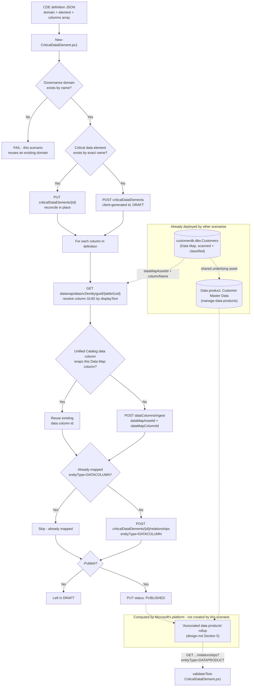

## 1. Scenario summary

Creates a **critical data element (CDE)** in Microsoft Purview Unified Catalog — a governance-domain-scoped
logical concept ("Customer ID") that maps one or more physical columns from one or more data
assets into a single thing a data quality rule, an access policy, or a data consumer can reason
about once — resolves and maps a real, already-scanned column to it, and validates Microsoft's
own automatically-computed "associated data products" rollup as a live cross-check against this
library's `manage-data-products` scenario. This is the piece that answers a question neither of
this repo's other two Unified Catalog scenarios can: not "which table is authoritative" (that's a
data product) and not "what does this business term mean" (that's a glossary term), but "which
*columns*, across however many source systems, are actually the same piece of information."

**Who it's for:** a data governance or platform team that has already run
`scenarios/data-map/scan-azure-sql-and-classify/` (to scan a source) and
`scenarios/unified-catalog/curate-business-glossary/` (to create the governance domain), and now
wants a single governed concept for a column that shows up, differently spelled, in more than one
system — defined, reviewed, and versioned via a pull request, not clicked together one column at
a time in the portal.

## 2. Business/regulatory driver

A critical data element exists because not every column deserves the same governance attention.
Microsoft's own framing: "Not all data elements have the same importance or sensitivity.
Dedicating resources to manage the quality of all data indiscriminately can be impractical and
costly" [[1]](#12-references). A CDE lets a governance team name the handful of columns —
customer identifiers, financial identifiers, regulated PII — that actually warrant elevated
scrutiny, and then attach data quality rules and access policies to that named concept instead of
re-deriving "which columns matter" from scratch on every project [[1]](#12-references)
[[3]](#12-references).

Beyond that operational driver, this scenario supports:
- **Regulatory data inventories** — PCI-DSS, GDPR, and HIPAA all effectively require an
  organization to know where a specific category of regulated data lives across every system that
  stores it. A CDE named "Customer ID" (or, in a straightforward extension of this same pattern,
  "Social Security Number" or "Cardholder Data") *is* that inventory, expressed as a first-class,
  API-manageable Purview object rather than a spreadsheet maintained outside the platform.
- **Cross-system data quality accountability** — Microsoft Purview Data Quality can measure and
  score critical data elements specifically, not just individual table columns
  [[1]](#12-references) [[2]](#12-references) — a CDE-level quality score answers "is our
  customer identifier trustworthy everywhere it appears," a question no single table's own DQ
  score can answer alone.
- **Consistent onboarding for new sources** — Microsoft's own framing: "when data producers create
  a new asset, they can use this element as a blueprint to provide quality information in the
  correct format" [[6]](#12-references) — a named CDE gives a new source's owner something
  concrete to map their own "CustID"-equivalent column against, instead of guessing.

## 3. Prerequisites

Full licensing detail and citations: `docs/licensing-matrix.md`. Summary for this scenario:

| Requirement | Minimum | Notes |
|---|---|---|
| Unified Catalog data governance | **Pay-as-you-go (PAYG)**, billed on unique **governed assets/day** | See §10 — this scenario typically adds **no incremental cost** when it maps a column that already belongs to an asset another data product or CDE already governs |
| A completed scan | `scenarios/data-map/scan-azure-sql-and-classify/` run at least once | This scenario consumes that scenario's output (a Data Map asset GUID) — it does not scan anything itself |
| The governance domain | `scenarios/unified-catalog/curate-business-glossary/` run at least once, **published** | This scenario looks up the domain by name rather than creating one; Microsoft's docs require the domain to be published before a CDE within it can be published (§8) |
| Role to create/edit a critical data element and add columns | **Data Steward AND Data Product Owner**, both, on the governance domain | Microsoft's own prerequisite: "To create critical data elements and add columns to them, you must have data steward and data product owner permissions" [[1]](#12-references) — a stricter combined requirement than `manage-data-products`' Data Product Owner-only prerequisite. `docs/rbac-model.md` §5 |
| Role to resolve column GUIDs from Data Map | **Data Reader** on the asset's Data Map collection | Same as `manage-data-products/README.md` §3's Data Map access note; needed here because this scenario, unlike its siblings, reads the table entity directly from Data Map/Atlas (design.md §4) |
| Automation identity (Unified Catalog + Data Map + Graph) | Data Steward + Data Product Owner in Unified Catalog, Data Reader on the Data Map collection, `User.Read.All` application permission in Graph | Same service-principal pattern as `manage-data-products`; this scenario's identity additionally calls the Data Map/Atlas Entity API directly |

**The Data Steward/Data Product Owner role pair is domain-scoped, not element-scoped** — the same
over-breadth `manage-data-products/README.md` §3 and `curate-business-glossary/README.md` §3
already flag for their own domain-level roles applies identically here: a compromised or
over-broadly-assigned credential holding this role pair can create, edit, or unpublish *any*
critical data element (or data product, or glossary term) in its assigned domain(s), not just the
"Customer ID" element this scenario's config targets. Scope the role assignment to only the
domain(s) this automation curates — see the cross-referenced compensating-controls note in either
sibling README.

> Verify current entitlement names against `docs/licensing-matrix.md` and the Product Terms before
> a sales commitment — SKU names and PAYG meters change. This entire feature is Microsoft-labeled
> **preview** as of this build (the concept page's own title is "Critical data elements
> (preview)") — re-check GA status before a customer-facing commitment (§11).

## 4. Architecture



Both the **Purview Unified Catalog REST API** (`docs/automation-surface.md` surface 4 —
**Critical Data Elements** and **Data Columns** operation groups) and, for the first time in this
repo, the **Data Map/Atlas Entity API** (the same surface 4 family
`end-to-end-lineage-validation`/`custom-process-lineage` use) from the same script, plus
**Microsoft Graph** (surface 3) for owner-identity resolution.

## 5. Step-by-step implementation

### Portal path (for a first manual walkthrough / to validate intent before scripting)

1. Sign in to the [Microsoft Purview portal](https://purview.microsoft.com) → **Unified Catalog**
   → **Catalog management** → **Governance domains** → select `Customer Experience` → **Details**
   tab → **Critical data elements** card → **View all** → **New critical data element**
   [[1]](#12-references).
2. **Basic details**: Name `Customer ID`, description as in the definition file, owner your Data
   Steward account, expected data type **Text**. **Next** → (no required custom attributes in
   this scenario) → **Create** [[1]](#12-references).
3. On the new element's details page, select **+ Add column** → search for `customerdb.dbo.Customers`
   → select the `CustomerID` column → **Add** [[1]](#12-references).
4. Note the **Associated data products** section below the columns list — it populates
   automatically once a mapped column belongs to an asset already linked to a data product
   [[1]](#12-references).
5. Select **Status** → **Published** (only after confirming the governance domain itself shows as
   published) [[1]](#12-references).

### Script path (idempotent, parameterized, dry-run capable)

```powershell
# 1. Dry run - reports every change, makes none (still performs read-only lookups against the
#    live tenant, including the Data Map column-resolution call, to accurately report
#    create-vs-update - see Section 11)
./deploy/New-CriticalDataElement.ps1 `
    -PurviewAccountEndpoint 'https://api.purview-service.microsoft.com' `
    -DataMapEndpoint 'https://api.purview-service.microsoft.com' `
    -TenantId $TenantId -AppId $AppId -ClientSecret $ClientSecret `
    -DefinitionPath './deploy/config/customer-id-cde.sample.json' -WhatIf

# 2. Deploy in DRAFT status (default) for review
./deploy/New-CriticalDataElement.ps1 `
    -PurviewAccountEndpoint 'https://api.purview-service.microsoft.com' `
    -DataMapEndpoint 'https://api.purview-service.microsoft.com' `
    -TenantId $TenantId -AppId $AppId -ClientSecret $ClientSecret `
    -DefinitionPath './deploy/config/customer-id-cde.sample.json'

# 3. Publish once reviewed
./deploy/New-CriticalDataElement.ps1 `
    -PurviewAccountEndpoint 'https://api.purview-service.microsoft.com' `
    -DataMapEndpoint 'https://api.purview-service.microsoft.com' `
    -TenantId $TenantId -AppId $AppId -ClientSecret $ClientSecret `
    -DefinitionPath './deploy/config/customer-id-cde.sample.json' -Publish

# 4. Validate, including the associated-data-products cross-check
./validate/Test-CriticalDataElement.ps1 `
    -PurviewAccountEndpoint 'https://api.purview-service.microsoft.com' `
    -DataMapEndpoint 'https://api.purview-service.microsoft.com' `
    -TenantId $TenantId -AppId $AppId -ClientSecret $ClientSecret `
    -DefinitionPath './deploy/config/customer-id-cde.sample.json' -DataProductName 'Customer Master Data'
```

Before step 1, replace `columns[].dataMapAssetId` in the definition file with the real Data Map
asset GUID for `customerdb.dbo.Customers` — the same GUID `manage-data-products`' own definition
file uses, copied from the asset's **Overview** page in the portal after
`scenarios/data-map/scan-azure-sql-and-classify/` has scanned it at least once. Unlike
`manage-data-products`, you do **not** need to separately find a column-level GUID — the script
resolves it from `columnName` (§11, design.md §4). The script refuses to run against the
placeholder nil GUID.

## 6. Configuration reference

| Object | Field | Source | Notes |
|---|---|---|---|
| Critical data element | `id` | Client-generated GUID | Same identity model as glossary terms and data products — design.md §3 |
| Critical data element | `dataType` | `TEXT` (this scenario) — full enum: `TEXT`, `NUMBER`, `DATETIME`, `BOOLEAN` | Matches the portal's own four expected-data-type options exactly (unlike data products' 14-vs-11 type mismatch) |
| Critical data element | `status` | `DRAFT` → `PUBLISHED` → `EXPIRED` | No documented access-policy publish gate (contrast with data products — §3) |
| Critical data element | `contacts.owner[].id` | Entra object ID | Resolved from the definition file's UPN, same as `manage-data-products` |
| Data column (Unified Catalog) | `id` | Server-assigned GUID from **Data Columns - Ingest**, distinct from both the Data Map column's own GUID and the Data Map table's GUID | Critical Data Elements - Create Relationship links against *this* id |
| Data column (Unified Catalog) | `source.assetId` / `source.columnId` | The Data Map table GUID / the Data Map column GUID this scenario resolves | The only fields **Data Columns - Ingest** requires |
| Relationship | `entityType` | `DATACOLUMN` (this scenario's choice) | See §11's `CRITICALDATACOLUMN`-vs-`DATACOLUMN` VERIFY — every worked example in Microsoft's own reference pages uses `CRITICALDATACOLUMN`, but the formally-documented enum doesn't include it |
| Relationship | `relationshipType` | `Related` | The only value this scenario's script sends |

Full request/response shapes: `deploy/New-CriticalDataElement.ps1`'s inline comments and `.NOTES`
block cite the exact Microsoft Learn REST reference pages for every operation used.

## 7. Validation / how to prove it works

1. **Automated check** — `./validate/Test-CriticalDataElement.ps1` confirms the critical data
   element exists with the expected data type/description/owner, confirms each configured column
   resolves and is mapped, and reports (does not fail on) the DATAPRODUCT relationship rollup as
   an informational cross-check. Exits non-zero on any hard failure (safe for a CI-style
   pre-flight).
2. **Portal check** — Purview portal → Unified Catalog → **Discovery** → **Enterprise glossary** →
   **Critical data elements** tab → open `Customer ID` → confirm the **Overview** tab lists the
   mapped `CustomerID` column and, if `manage-data-products` has already run, `Customer Master
   Data` under **Associated data products** [[1]](#12-references).
3. **Cross-scenario check** — open the linked `customerdb.dbo.Customers` asset's own **Governance**
   tab and confirm `Customer ID` appears under "Critical data elements associated with columns in
   the asset" [[13]](#12-references) — proof the mapping is bidirectional, not just visible from
   the CDE side.

## 8. Operations & tuning

**Review-before-publish workflow:** identical discipline to `manage-data-products/README.md` §8 —
this script's default (`DRAFT`, no `-Publish`) gives a human review point. Confirm the governance
domain itself is published before attempting `-Publish` on the element — Microsoft's docs state
this as a prerequisite for CDEs the same way they state it for glossary terms
[[1]](#12-references), even though (unlike data products) there is no separate access-policy gate
to configure first.

**Re-running after an edit:** add a column, adjust the description, or add a second source system
mapping the same logical concept, then re-run `New-CriticalDataElement.ps1`. The create/update
path always reconciles the element's own fields **to the definition file's current content** —
same caveat as `manage-data-products/README.md` §8. Column mappings are purely additive on
re-run: removing a `columns[]` entry from the file does **not** unmap it (this script never
deletes a relationship — see rollback.md for the explicit unmapping path).

**"Associated data products" refresh lag:** Microsoft's own docs state this rollup "only refreshes
when you add or remove columns" [[1]](#12-references) — so a data product created or modified
*after* this scenario's last column-mapping run may not yet be reflected. Re-running
`New-CriticalDataElement.ps1` against an unchanged definition file is a no-op for the columns
themselves (idempotent — nothing to add or remove) and will **not** force a rollup refresh; if a
downstream consumer needs a live view, query the DATAPRODUCT relationship directly (as
`validate/Test-CriticalDataElement.ps1` does) rather than relying on cached portal state.

**Run validate after every deploy, not just on demand:** `New-CriticalDataElement.ps1` treats a
column that fails to resolve (wrong `columnName` casing, a Data Map asset that hasn't finished
scanning) as a non-fatal `Write-Warning`-and-skip, by design — one bad entry in a multi-column
`columns[]` array shouldn't abort mapping the rest. That design means the deploy script's own
console output is **not** a reliable signal that every configured column actually got mapped.
`validate/Test-CriticalDataElement.ps1` is the actual safety net (it hard-`[FAIL]`s an unresolved
column) — treat a deploy run as incomplete until validate has been run against it, especially in
unattended/CI-style execution where nobody is watching the deploy script's console output live.

**Compliance-evidence caution:** this feature is Microsoft-labeled preview (§3, §11) — a CDE-based
regulated-data inventory (§2) is a genuinely strong internal governance narrative, but do not cite
it as the sole system of record in a formal regulatory audit response until the feature reaches
GA; preview features carry no Microsoft SLA or support commitment.

**Governed-asset billing awareness:** because this scenario typically maps a column belonging to
an asset another scenario (`manage-data-products`) already governs, it adds no incremental cost
in the common case — but the first time a *new*, previously-ungoverned asset gets its first column
mapped to a CDE, that asset becomes a governed asset and starts accruing the per-asset/day PAYG
meter (§10). Track new CDE column mappings against previously-unscanned or previously-ungoverned
sources as a cost event, not just a governance event.

## 9. Rollback / decommission

See `rollback.md` for the full staged procedure (unpublish → unmap columns → purge). Quick
reference: `./deploy/Remove-CriticalDataElement.ps1` unpublishes the critical data element
(reversible); add `-RemoveLinks` to also remove its column mappings; add `-Purge` to permanently
delete the critical data element itself. The underlying Unified Catalog data column wrapper
objects are never deleted by this scenario — the Data Columns operation group has no Delete
operation as of the API version this scenario targets (design.md §7).

## 10. Cost & licensing notes

- **Governed-asset billing is deduplicated across concepts, confirmed directly by Microsoft's
  billing FAQ:** "I have the same data asset attached to both a data product and a critical data
  element. How am I charged? You aren't charged for a data asset attached to both a data product
  and a critical data element. You're charged for a data asset once." [[9]](#12-references) This
  scenario's default configuration maps a column belonging to
  `manage-data-products`' already-governed `customerdb.dbo.Customers` asset, so it adds **zero**
  incremental governed-asset cost in that configuration.
- **Mapping a column from a previously-ungoverned asset does trigger billing**, the same
  per-unique-governed-asset-per-day meter `manage-data-products/README.md` §10 documents — a CDE
  is one of the governance concepts Microsoft's billing model explicitly names as a billing
  trigger [[8]](#12-references) [[9]](#12-references), on equal footing with a data product.
- **No per-user license required for the automation itself** — Unified Catalog curation stays
  PAYG-only (`docs/licensing-matrix.md` §2).

## 11. Known limitations & gotchas

- **This feature is Microsoft-labeled preview.** The concept documentation's own page title is
  "Critical data elements (preview)," and the bulk-CSV-import path is separately labeled preview
  again. Re-check GA status before a customer-facing commitment.
- **VERIFY — `entityType=DATACOLUMN` vs. `CRITICALDATACOLUMN`.** Every worked request/response
  example this build fetched for the Critical Data Elements Create/List/Delete Relationship
  operations uses `entityType=CRITICALDATACOLUMN`, but the formally-documented `EntityCategory`
  enum on each of those same pages has no such value — it lists `DATACOLUMN` instead. This
  scenario's scripts send `DATACOLUMN` (design.md §6). If a tenant rejects it, try
  `CRITICALDATACOLUMN` and update this scenario's `.NOTES` with the confirmed answer.
- **VERIFY — whether the DATAPRODUCT relationship rollup is actually observable via this REST
  call.** Microsoft's portal documentation describes the "associated data products" list as
  automatically computed, but no Microsoft Learn page this build's grounding pass found confirms
  it is surfaced through **Critical Data Elements - List Relationships** with
  `entityType=DATAPRODUCT` specifically (design.md §5). `validate/Test-CriticalDataElement.ps1`
  treats an empty result as a `[WARN]`, not a `[FAIL]`.
- **Column-name matching is case-sensitive exact match** against
  `entity.relationshipAttributes.columns[].displayText`. A column whose display name differs in
  case from the definition file's `columnName` will not be found — flagged inline in
  `deploy/New-CriticalDataElement.ps1`'s `.NOTES`.
- **VERIFY — the Critical Data Elements Query `nameKeyword` filter's exact match semantics**, the
  same open question `curate-business-glossary/README.md` §11 and
  `manage-data-products/README.md` §11 record for their own object types — this scenario applies
  the identical client-side-exact-match mitigation.
- **No REST `Delete` operation exists for a Unified Catalog data column wrapper**, as of API
  version `2026-03-20-preview`. `rollback.md` documents this as a genuine capability gap, not a
  scope choice.
- **This scenario does not link the critical data element to glossary terms or configure its
  access policy** — both are portal-only or out of this build's grounding, per design.md §7's
  non-goal list.
- **Deleting the Data Map entity used to resolve a column's GUID leaves the mapping stale**, the
  same "removed from Data Map, still shows in Unified Catalog until manually removed" behavior
  Microsoft documents for CDE columns generally [[1]](#12-references) — this scenario's validate
  script will report a `[FAIL]` on the affected column (it can no longer be re-resolved from Data
  Map) rather than silently passing.

## 12. References

1. Critical data elements (preview) — concept, prerequisites, Add columns flow, Associated data
   products rollup, delete/edit procedures — <https://learn.microsoft.com/purview/unified-catalog-critical-data-elements>
2. Data Quality for Critical Data Elements in Unified Catalog (preview) — CDE-level quality
   scoring — <https://learn.microsoft.com/purview/unified-catalog-data-quality-critical-data-elements>
3. Learn about Microsoft Purview Unified Catalog — critical data elements feature overview —
   <https://learn.microsoft.com/purview/unified-catalog>
4. Data governance roles and permissions in Microsoft Purview — Data Steward and Data Product
   Owner roles — <https://learn.microsoft.com/purview/data-governance-roles-permissions>
5. Governance domains in Unified Catalog — critical data elements as a governance-domain business
   concept — <https://learn.microsoft.com/purview/unified-catalog-governance-domains>
6. Critical data elements (preview) — "Customer ID" CustID/CID mapping example, blueprint framing
   — <https://learn.microsoft.com/purview/unified-catalog-critical-data-elements>
7. Learn about data governance billing — Unified Catalog billing, governed assets defined via data
   products or critical data elements — <https://learn.microsoft.com/purview/data-governance-billing>
8. Learn about data governance billing — per-asset-per-day meter — <https://learn.microsoft.com/purview/data-governance-billing>
9. Data governance billing frequently asked questions — data-product/CDE dedup, confirmed verbatim
   — <https://learn.microsoft.com/purview/data-governance-billing-faq>
10. Purview Unified Catalog REST API — Critical Data Elements operation group (Count/Create/Create
    Relationship/Delete/Delete Relationship/Get/Get Facets/List/List Relationships/Query/Update) —
    <https://learn.microsoft.com/rest/api/purview/purview-unified-catalog/critical-data-elements?view=rest-purview-purview-unified-catalog-2026-03-20-preview>
11. Purview Unified Catalog REST API — Data Columns operation group (Add Related Entity/Delete
    Related/Get/Ingest/List Related Entities/Query) —
    <https://learn.microsoft.com/rest/api/purview/purview-unified-catalog/data-columns?view=rest-purview-purview-unified-catalog-2026-03-20-preview>
12. Unified Catalog API (Public Preview) overview — release notes confirming Data Columns APIs and
    Critical Data Elements Count added in `2026-03-20-preview` —
    <https://learn.microsoft.com/rest/api/purview/unified-catalog-api-overview>
13. Search for data assets — governed asset Governance tab, "Critical data elements associated
    with columns in the asset" — <https://learn.microsoft.com/purview/unified-catalog-data-assets-search>
14. Type definitions and how to create custom types — `azure_sql_table`'s `columns`
    relationshipAttributeDefs (`relationshipTypeName: azure_sql_table_columns`), confirmed via
    Microsoft's own worked example for this exact entity type —
    <https://learn.microsoft.com/purview/data-gov-api-custom-types>
15. Entity - Get (Data Map/Atlas REST API, `GET /datamap/api/atlas/v2/entity/guid/{guid}`) —
    <https://learn.microsoft.com/rest/api/purview/datamapdataplane/entity/get?view=rest-purview-datamapdataplane-2023-09-01>
16. Tutorial: Authenticate for APIs — service principal setup, Unified Catalog role assignment,
    client-credentials token flow — <https://learn.microsoft.com/purview/data-gov-api-rest-data-plane>
17. Get a user (Microsoft Graph) — `User.Read.All` application permission —
    <https://learn.microsoft.com/graph/api/user-get>

> Re-verify all links against current Microsoft Learn before a customer-facing engagement — this
> scenario targets Unified Catalog's **preview** REST API surface (`2026-03-20-preview`), whose
> `Data Columns` operation group and the `Critical Data Elements` `Count` operation were only
> added in this exact version [[12]](#12-references), and the underlying critical-data-elements
> *feature itself* (not just its API) is separately Microsoft-labeled preview.
