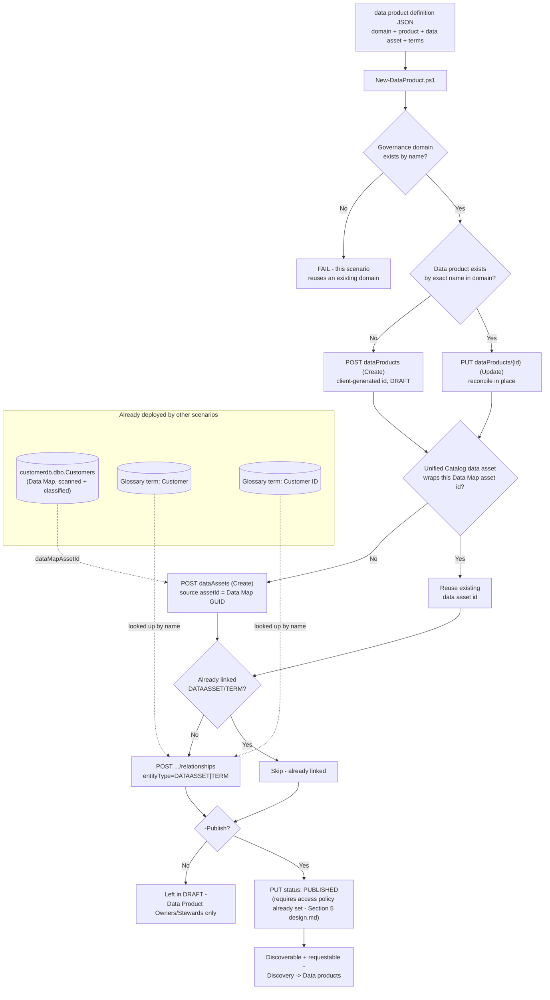

## 1. Scenario summary

Creates a **data product** in Microsoft Purview Unified Catalog — a named, ownable, requestable
grouping of data assets with a business use case attached — wraps an already-scanned Azure SQL
table as a Unified Catalog data asset, and links both that asset and its governing glossary terms
to the product, all from a single declarative JSON file. This is the piece that turns this
library's earlier Unified Catalog and Data Map scenarios into something a business consumer can
actually find and request: a scanned table with a governed glossary term is still, on its own,
just a scanned table with a label — a data product is what makes it discoverable, requestable, and
ownable as "Customer Master Data" instead of `customerdb.dbo.Customers`.

**Who it's for:** a data governance or platform team that has already run
[`data-map/scan-azure-sql-and-classify`](/scenarios/data-map/scan-azure-sql-and-classify/) (to scan and classify a source) and
[`unified-catalog/curate-business-glossary`](/scenarios/unified-catalog/curate-business-glossary/) (to define the `Customer` / `Customer ID`
terms), and now wants to package that governed table as a self-service-discoverable product —
defined, reviewed, and versioned via a pull request, not assembled one portal click at a time.

## 2. Business/regulatory driver

Data products are Unified Catalog's answer to a specific, recurring failure mode: a consumer who
needs "the customer table" has to request access to 15 similarly-named tables individually, and a
data owner who tightens a use-case policy has to update each of those tables' permissions one at a
time [[3]](#12-references). Grouping them into one data product means one access request, one
policy surface, and one place a data owner curates description/use-case/ownership as the
underlying assets change [[3]](#12-references) [[10]](#12-references).

Beyond that operational driver, this scenario supports:
- **Least-privilege access requests** — a consumer requests exactly the data product they need,
  through a tracked, approvable workflow (`design.md` §5), rather than being granted broad Data Map
  collection access "to be safe."
- **SOC 2 / ISO 27001 access-governance evidence** — every access request against a published data
  product is logged and tiered through named approvers [[4]](#12-references), a stronger audit
  trail than ad hoc table-level permission grants.
- **Data quality accountability** — a data product carries an aggregate data-quality score computed
  from its linked assets [[1]](#12-references), directly consuming the output of
  [`data-quality/rules-and-scorecards`](/scenarios/data-quality/rules-and-scorecards/) once that scenario's rules are applied to this
  same "Customer" asset.

## 3. Prerequisites

Full licensing detail and citations: `docs/licensing-matrix.md`. Summary for this scenario:

| Requirement | Minimum | Notes |
|---|---|---|
| Unified Catalog data governance | **Pay-as-you-go (PAYG)**, billed on unique **governed assets/day** | Unlike `curate-business-glossary`, **this scenario does incur a charge** — see §10. Linking a real data asset to a data product is exactly the billing trigger Microsoft's FAQ describes [[8]](#12-references) |
| A completed scan | [`data-map/scan-azure-sql-and-classify`](/scenarios/data-map/scan-azure-sql-and-classify/) run at least once | This scenario consumes that scenario's output (a Data Map asset GUID for `customerdb.dbo.Customers`) — it does not scan anything itself |
| The governing terms | [`unified-catalog/curate-business-glossary`](/scenarios/unified-catalog/curate-business-glossary/) run at least once (with `-Publish` if the terms should be linkable in a published state) | This scenario looks up `Customer` and `Customer ID` by name in the same domain rather than creating them |
| Role to author the data product | **Data Product Owner** (governance-domain-level role, assigned on the domain's **Roles** tab — same role model as `Data Steward`) | `docs/rbac-model.md` §5 |
| Role to link the underlying Data Map asset | **Data Reader** on the asset's Data Map collection, in addition to Data Product Owner in Unified Catalog | Two separate role systems — `docs/rbac-model.md` §5's "Rule of thumb" |
| Automation identity (Unified Catalog + Graph) | Same service-principal pattern as `curate-business-glossary`: Data Product Owner in Unified Catalog, `User.Read.All` application permission in Graph | §3's compensating-controls note in `curate-business-glossary/README.md` applies identically here — this scenario resolves the data product's owner the same way |
| **Manual, portal-only prerequisite before `-Publish`** | A **data product access policy** configured via **Manage policies** on the data product's details page | Microsoft's own docs: "Before you can publish, you need to add data assets to your data product and set up a data access policy" [[1]](#12-references) — `design.md` §5 explains why this scenario cannot script it |

> Verify current entitlement names against `docs/licensing-matrix.md` and the Product Terms before
> a sales commitment — SKU names and PAYG meters change.

## 4. Architecture



One Unified Catalog **data product**, one Unified Catalog **data asset** wrapper, and their
relationships — all authored via the **Purview Unified Catalog REST API**
(`docs/automation-surface.md` surface 4). The one place this scenario also calls **Microsoft
Graph** (surface 3) is owner-identity resolution, same as `curate-business-glossary/design.md` §5.

## 5. Step-by-step implementation

### Portal path (for a first manual walkthrough / to validate intent before scripting)

1. Sign in to the [Microsoft Purview portal](https://purview.microsoft.com) → **Unified Catalog**
   → **Catalog management** → **Data products** → **New data product**.
2. **Basic details**: Name `Customer Master Data`, Type **Master and reference data**, Audience
   `Data Analyst`/`Business Analyst`/`Data Engineer`, Owner your Data Product Owner account.
   **Next** [[1]](#12-references).
3. **Business details**: Governance domain `Customer Experience` (the same domain
   `curate-business-glossary` created), Use case as in the definition file. **Next** → **Create**.
4. On the new data product's details page, **Add data assets** → search for
   `customerdb.dbo.Customers` → select it → **Add** [[1]](#12-references).
5. Under **Glossary terms**, select **+** → search for `Customer` and `Customer ID` → **Add**
   [[1]](#12-references).
6. Select **Manage policies** → configure **Permitted access** purposes and **Access request
   approvers** (defaults to the data product owner) [[4]](#12-references).
7. Select **Publish** on the data product's details page [[1]](#12-references).

### Script path (idempotent, parameterized, dry-run capable)

```powershell
# 1. Dry run - reports every change, makes none (still performs read-only lookups against the
#    live tenant to accurately report create-vs-update - see README.md Section 11)
./deploy/New-DataProduct.ps1 `
    -PurviewAccountEndpoint 'https://api.purview-service.microsoft.com' `
    -TenantId $TenantId -AppId $AppId -ClientSecret $ClientSecret `
    -DefinitionPath './deploy/config/customer-master-data-product.sample.json' -WhatIf

# 2. Deploy in DRAFT status (default) for review
./deploy/New-DataProduct.ps1 `
    -PurviewAccountEndpoint 'https://api.purview-service.microsoft.com' `
    -TenantId $TenantId -AppId $AppId -ClientSecret $ClientSecret `
    -DefinitionPath './deploy/config/customer-master-data-product.sample.json'

# 3. Configure the data product access policy in the portal (Section 3 - not scriptable), then:
./deploy/New-DataProduct.ps1 `
    -PurviewAccountEndpoint 'https://api.purview-service.microsoft.com' `
    -TenantId $TenantId -AppId $AppId -ClientSecret $ClientSecret `
    -DefinitionPath './deploy/config/customer-master-data-product.sample.json' -Publish

# 4. Validate
./validate/Test-DataProduct.ps1 `
    -PurviewAccountEndpoint 'https://api.purview-service.microsoft.com' `
    -TenantId $TenantId -AppId $AppId -ClientSecret $ClientSecret `
    -DefinitionPath './deploy/config/customer-master-data-product.sample.json'
```

Before step 1, replace `dataAsset.dataMapAssetId` in the definition file with the real Data Map
asset GUID for `customerdb.dbo.Customers` — copy it from the asset's **Overview** page in the
portal after [`data-map/scan-azure-sql-and-classify`](/scenarios/data-map/scan-azure-sql-and-classify/) has scanned it at least once
(§11). The script refuses to run against the placeholder nil GUID.

## 6. Configuration reference

| Object | Field | Source | Notes |
|---|---|---|---|
| Data product | `id` | Client-generated GUID | Same identity model as glossary terms — see `design.md` §3 |
| Data product | `type` | `Master` (this scenario) — full enum: `Master`, `Reference`, `Analytical`, `AI`, `MasterDataAndReferenceData`, `BusinessSystemOrApplication`, `ModelTypes`, `DashboardsOrReports`, `Operational`, `MLAITrainingDataSet`, `MLAITestingDataSet`, `TransactionalDataset`, `AnalyticsModel`, `SemanticModel` | The REST enum's 14 values don't map one-to-one onto the portal's 11 documented type labels [[1]](#12-references) — e.g. the portal shows "Master and reference data" as one option; the REST enum has both a standalone `Master` and a separate `MasterDataAndReferenceData`. This scenario uses `Master` for the customer-identity narrative; confirm the portal-vs-REST label mapping in a pilot tenant before presenting type choices to a non-technical curator |
| Data product | `status` | `DRAFT` → `PUBLISHED` | Publish additionally requires an access policy — §3, `design.md` §5 |
| Data product | `contacts.owner[].id` | Entra object ID | Resolved from the definition file's UPN, same as `curate-business-glossary` |
| Data asset (Unified Catalog) | `id` | Server-assigned GUID, **distinct** from the Data Map asset's own GUID | `design.md` §4 — Create Relationship links against *this* id |
| Data asset (Unified Catalog) | `source.assetId` | The Data Map asset's GUID | The only field this scenario sets on create; type/schema/classifications are server-inferred from Data Map |
| Relationship | `entityType` | `DATAASSET` \| `TERM` | This scenario's script links only these two entity types — `design.md` §6 lists the others (`CRITICALDATAELEMENT`, `OBJECTIVE`, etc.) as non-goals |
| Relationship | `relationshipType` | `Related` | The only value this scenario's script sends |

Full request/response shapes: `deploy/New-DataProduct.ps1`'s inline comments and `.NOTES` block
cite the exact Microsoft Learn REST reference pages for every operation used.

## 7. Validation / how to prove it works

1. **Automated check** — `./validate/Test-DataProduct.ps1` confirms the data product exists with
   the expected type/description/updateFrequency/audience/owner-contact, confirms the data asset
   wrapper and both relationships exist, and reports the classifications Data Map scanning found on
   the underlying asset. Exits non-zero on any hard failure (safe for a CI-style pre-flight).
   Publish status is reported as a warning, not a hard failure.
2. **Portal check** — Purview portal → Unified Catalog → **Discovery** → **Data products** →
   explore the `Customer Experience` domain → open `Customer Master Data` → confirm the **Details**
   tab shows the expected description/use case/owner, and the **Data assets** and **Glossary
   terms** sections both list one item [[13]](#12-references).
3. **Consumer-visibility check (after `-Publish` and a configured access policy)** — as a
   **Catalog Reader**-only account, search Unified Catalog **Discovery** for "Customer" and confirm
   `Customer Master Data` appears with a working **Request access** button
   [[3]](#12-references) [[4]](#12-references).
4. **Cross-scenario check** — open the linked `customerdb.dbo.Customers` asset's own **Governance**
   tab and confirm `Customer Master Data` appears under "Data products the asset is part of"
   [[12]](#12-references) — proof the link is bidirectional, not just visible from the product side.

## 8. Operations & tuning

**Review-before-publish workflow:** identical discipline to `curate-business-glossary/README.md`
§8 — this script's default (`DRAFT`, no `-Publish`) gives a human review point before the product
becomes requestable. Unlike a glossary term, though, a data product also needs its **access
policy** configured before `-Publish` will succeed at all (§3) — build that portal step into the
same review checklist, not as an afterthought discovered only when the publish call fails.

**Re-running after an edit:** change the definition file (add a term, adjust the use case, update
frequency) and re-run `New-DataProduct.ps1`. Like `curate-business-glossary`, the create/update
path always reconciles the data product **to the definition file's current content**, not a merge
— a portal-made edit not reflected in the file will be overwritten on the next deploy run. The
narrower `-Publish`-only status transition does not have this problem (`design.md` §5).

**Asset-count and quality-score drift:** the data product's `additionalProperties.assetCount` (this
scenario's `validate` script reports it as an informational KPI) and its aggregate
`dataQualityScore` [[1]](#12-references) both change independently of this scenario's own runs — a
portal user adding another asset, or [`data-quality/rules-and-scorecards`](/scenarios/data-quality/rules-and-scorecards/)'s scan
schedule producing a new score. Track both as operational metrics once the product portfolio grows
past what a human can eyeball weekly.

**Access-request backlog:** every access request against this data product is queued for the
approvers configured in its access policy [[4]](#12-references) — an unattended approver queue
defeats the "self-service" value proposition this scenario is built around. This is portal-only
operational hygiene, not something this scenario's scripts monitor.

## 9. Rollback / decommission

See `rollback.md` for the full staged procedure (unpublish → unlink → purge). Quick reference:
`./deploy/Remove-DataProduct.ps1` unpublishes the data product (reversible); add `-RemoveLinks` to
also remove its asset/term relationships; add `-Purge` to permanently delete the data product
itself.

## 10. Cost & licensing notes

- **Unlike `curate-business-glossary`, this scenario incurs a PAYG charge.** Microsoft's billing
  FAQ is explicit about the trigger: creating domains and data products with nothing attached costs
  nothing, but once a data asset is linked, billing is **per unique governed asset per day**
  [[8]](#12-references). This scenario links exactly one governed asset
  (`customerdb.dbo.Customers`), so it adds one billed asset — deduplicated if that same asset is
  also linked from other data products, glossary terms, or critical data elements
  [[9]](#12-references) — not one charge per relationship this scenario creates.
- **No per-user license required for the automation itself** — Unified Catalog curation stays
  PAYG-only (`docs/licensing-matrix.md` §2). A human requesting access to the resulting data
  product still needs whatever license the underlying data asset's own access model requires
  (e.g. an Azure SQL Database role) — Unified Catalog access policies gate the *request* workflow,
  not the underlying data-plane permission grant itself [[4]](#12-references).

## 11. Known limitations & gotchas

- **`-Publish` requires a portal-only access policy this scenario cannot configure.** `design.md`
  §5 covers this in full; the practical effect is that a first-time `-Publish` run against a data
  product with no access policy configured may fail, and this scenario cannot tell you why beyond
  the `Write-Warning` printed before the attempt.
- **VERIFY — whether the REST `Update` operation enforces the access-policy prerequisite
  server-side, or only the portal UI does.** Not documented either way (`design.md` §5). If the
  REST call does *not* enforce it, this script could technically publish a data product with no
  access-request path configured for consumers — a real gap flagged in `reviews.md` (Red Team).
- **VERIFY — the `Data Products - Create Relationship` request body for `entityType=DATAASSET` and
  `entityType=TERM`.** The REST reference's only worked example is for
  `entityType=CRITICALDATACOLUMN` and includes an `assetId` field this script's `DATAASSET`/`TERM`
  calls omit (`design.md` §3, inline `.NOTES` in `deploy/New-DataProduct.ps1`). If a tenant rejects
  or silently ignores these calls, confirm the correct body shape per entity type against a pilot
  tenant or the Swagger specification linked from the API overview page
  [[15]](#12-references) before relying on this pattern at scale.
- **The two "Policies" concepts in Unified Catalog are not the same thing.** The REST API's
  `Policies` operation group returns the underlying RBAC authorization-policy engine (attribute/
  decision rules keyed by domain/product GUIDs) — **not** the "who can request access, what do they
  attest to" data product access policy the portal's **Manage policies** button configures
  (`design.md` §5). This scenario does not call the `Policies` REST operation group at all; do not
  assume it can be used to script access policies.
- **`nameKeyword` match semantics are undocumented**, the same open question
  `curate-business-glossary/README.md` §11 records for Query Terms — this scenario's
  `Find-DataProductByName` applies the identical client-side-exact-match mitigation and inherits
  the identical pagination caveat for very large domains.
- **Portal type labels vs. REST `type` enum values don't map one-to-one** — see §6's configuration
  reference note. Confirm the correct mapping before building a curator-facing UI on top of this
  script's config file format.
- **This scenario does not configure critical data elements or OKR links**, and does not register
  or scan the underlying Data Map source — `design.md` §6 has the full non-goal list.
- **Deleting the Unified Catalog data asset wrapper is opt-in and unchecked.**
  `Remove-DataProduct.ps1 -Purge -DeleteDataAssetWrapper` cannot confirm another data product isn't
  still referencing the same wrapper before deleting it — see `rollback.md`.

## 12. References

1. Create and manage data products — creation flow, data product types, Publish prerequisites (assets + access policy) — <https://learn.microsoft.com/purview/unified-catalog-data-products-create-manage>
2. Master data management in Microsoft Purview — the register/scan → create product → link term → curate flow this scenario automates — <https://learn.microsoft.com/purview/data-governance-master-data-management>
3. Learn about Microsoft Purview Unified Catalog — data products feature overview, scalable-governance rationale — <https://learn.microsoft.com/purview/unified-catalog>
4. Manage data product access policies — Manage policies flow, approval tiers, request statuses — <https://learn.microsoft.com/purview/unified-catalog-data-product-access-policies>
5. Create and manage glossary terms — Link terms to data products, assets, and critical data elements (preview) — <https://learn.microsoft.com/purview/unified-catalog-glossary-terms-create-manage#link-terms-to-data-products-assets-and-critical-data-elements-preview>
6. Data governance roles and permissions in Microsoft Purview — Data Product Owner role — <https://learn.microsoft.com/purview/data-governance-roles-permissions>
7. Learn about data governance billing — governed assets, per-asset-per-day meter — <https://learn.microsoft.com/purview/data-governance-billing>
8. Data governance billing frequently asked questions — unattached domains/data products aren't charged, billing starts on asset attach — <https://learn.microsoft.com/purview/data-governance-billing-faq>
9. Purview Unified Catalog REST API — Data Assets operation group (Create/Update/Delete By Id/Get By Id/List/Query/Create Relationship/List Relationships/Delete Relationship) — <https://learn.microsoft.com/rest/api/purview/purview-unified-catalog/data-assets?view=rest-purview-purview-unified-catalog-2026-03-20-preview>
10. Data products in Unified Catalog — scalable data governance rationale (one request instead of many) — <https://learn.microsoft.com/purview/unified-catalog-data-products>
11. Purview Unified Catalog REST API — Data Products operation group (Create/Update/Delete/Get/List/Query/Create Relationship/List Relationships/Delete Relationship/Count/Get Facets) — <https://learn.microsoft.com/rest/api/purview/purview-unified-catalog/data-products?view=rest-purview-purview-unified-catalog-2026-03-20-preview>
12. Search for data products in Unified Catalog — data product details page, data asset details page's "other data products" list — <https://learn.microsoft.com/purview/unified-catalog-data-products-search>
13. Search for data assets — governed asset Governance tab (data products / terms / CDEs / quality score) — <https://learn.microsoft.com/purview/unified-catalog-data-assets-search>
14. Purview Unified Catalog REST API — Policies operation group (the RBAC authorization-policy engine, distinct from the portal's data product access policy feature — `design.md` §5) — <https://learn.microsoft.com/rest/api/purview/purview-unified-catalog/policies?view=rest-purview-purview-unified-catalog-2026-03-20-preview>
15. Unified Catalog API (Public Preview) overview — scope, GA-only coverage, preview API versions, Swagger specification links — <https://learn.microsoft.com/rest/api/purview/unified-catalog-api-overview>
16. Tutorial: Authenticate for APIs — service principal setup, Unified Catalog role assignment, client-credentials token flow — <https://learn.microsoft.com/purview/data-gov-api-rest-data-plane>
17. Get a user (Microsoft Graph) — `User.Read.All` application permission — <https://learn.microsoft.com/graph/api/user-get>
18. Microsoft identity platform and the OAuth 2.0 client credentials flow — v2.0 token endpoint, `scope=.default` — <https://learn.microsoft.com/entra/identity-platform/v2-oauth2-client-creds-grant-flow>

> Re-verify all links against current Microsoft Learn before a customer-facing engagement — this
> scenario targets Unified Catalog's **preview** REST API surface (`2026-03-20-preview`), whose
> `Data Assets`/`Data Columns` operation groups were only added in this exact version
> [[15]](#12-references) and are therefore among the least-tenured of any REST surface this repo
> depends on.
