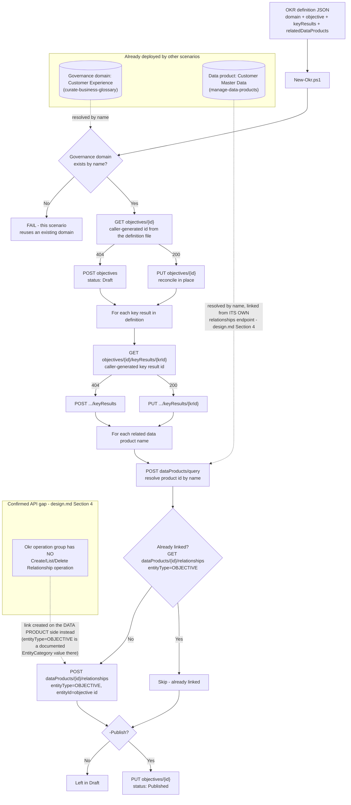

## 1. Scenario summary

Creates an **objective and key results (OKR)** in Microsoft Purview Unified Catalog, a
governance-domain-scoped business goal ("increase trust in customer master data") with
measurable key results, and links it to one or more already-existing **data products**, so a
business sponsor can see, directly inside the catalog, which curated data actually drives or
measures their goal. This is the piece that connects this repo's other two Unified Catalog
scenarios (`manage-data-products`, `manage-critical-data-elements`), which describe *what the
data is* and *which columns matter*, to *why any of it matters to the business*.

**Who it's for:** a governance-domain owner or data steward who has already run
`scenarios/unified-catalog/curate-business-glossary/` (to create the governance domain) and
`scenarios/unified-catalog/manage-data-products/` (to create a data product), and now wants to
express a board-legible business objective and wire it, as code, to the data product that backs
it, reviewed and versioned via a pull request, not clicked together once in the portal.

## 2. Business/regulatory driver

Microsoft's own framing for why OKRs exist inside a data catalog, not a separate OKR tool: "OKRs
link data products directly to real business objectives to bridge the gap between the business
and the data estate. Data governance isn't just an IT task or engineering best practice, it's a
critical part of value generation" [[1]](#12-references). Concretely:

- **Funding narrative for a CISO or data governance sponsor.** A governance program that can point
  to a named, owned, target-dated business objective, "reduce duplicate customer records from 8%
  to under 2%", with a live key-result score and a direct link to the data product being
  governed, is a materially stronger budget conversation than "we govern 20 tables." This mirrors
  Microsoft's own worked example: a "Customer Response" OKR linked to an email-campaign-results
  data product [[3]](#12-references).
- **Making a health/quality investment legible to non-technical stakeholders.** A key result's
  `progress`/`goal`/`max` triple is a business metric, not a technical one, it's the same
  vocabulary a business review already uses, deliberately, so a data quality improvement (fewer
  duplicate customer IDs) reads as a business outcome instead of an IT ticket.
- **Traceable accountability.** Each OKR has one or more named owners
  (`contacts.owner[]`), Microsoft's own guidance: "these users are responsible for maintaining a
  business objective... [and] should have knowledge of how the business functions"
  [[2]](#12-references), giving a governance program a named accountable business sponsor per
  objective, not just a technical data steward.

## 3. Prerequisites

Full licensing detail and citations: `docs/licensing-matrix.md`. Summary for this scenario:

| Requirement | Minimum | Notes |
|---|---|---|
| Unified Catalog data governance | **Pay-as-you-go (PAYG)**, billed on unique **governed assets/day** | §10, this scenario adds **no** governed-asset billing event of its own (it never attaches a raw data asset to anything; it links an objective to an already-governed data product) |
| The governance domain | `scenarios/unified-catalog/curate-business-glossary/` run at least once, **published** before `-Publish` | This scenario looks up the domain by name rather than creating one; Microsoft's docs require the domain to already be published before an OKR within it can be published [[6]](#12-references) |
| A data product to link to (recommended, not required) | `scenarios/unified-catalog/manage-data-products/` run at least once | The default definition file links to `manage-data-products`' own "Customer Master Data" product; omit `relatedDataProducts` to create a standalone OKR with nothing to link yet |
| Role to create/edit OKRs | **Steward role**, domain-scoped | Microsoft's own prerequisite: "To create and edit OKRs, you need the steward role" [[2]](#12-references), a *lighter* requirement than `manage-critical-data-elements`' combined Data Steward + Data Product Owner requirement (`README.md` §3 there), matching `curate-business-glossary`'s own steward-only bar for glossary terms. `docs/rbac-model.md` §5 |
| Role to link a data product (the relationship call is made on the *product*, not the OKR, design.md §4) | **Data Product Owner**, domain-scoped | Same role `manage-data-products/README.md` §3 already requires for its own `Create Relationship` calls |
| Automation identity (Unified Catalog + Graph) | Data Steward + Data Product Owner in Unified Catalog, `User.Read.All` application permission in Graph | Same service-principal pattern as `manage-data-products`/`manage-critical-data-elements` |

**The Data Steward/Data Product Owner role pair is domain-scoped, not OKR-scoped**, the identical
over-breadth `manage-data-products/README.md` §3, `manage-critical-data-elements/README.md` §3,
and `curate-business-glossary/README.md` §3 already flag for their own domain-level roles applies
here too: scope the role assignment to only the domain(s) this automation curates.

> Verify current entitlement names against `docs/licensing-matrix.md` and the Product Terms before
> a sales commitment. This entire feature is Microsoft-labeled **preview** as of this build (the
> concept page's own title is "Objectives and key results (OKRs) (preview)"), re-check GA status
> before a customer-facing commitment (§11).

## 4. Architecture



Uses the **Purview Unified Catalog REST API** (`docs/automation-surface.md` surface 4), the
**Okr** operation group for the objective/key-result CRUD, and the **Data Products** operation
group's own relationship operations (`entityType=OBJECTIVE`) for the data-product link, plus
**Microsoft Graph** (surface 3) for owner-identity resolution.

## 5. Step-by-step implementation

### Portal path (for a first manual walkthrough / to validate intent before scripting)

1. Sign in to the [Microsoft Purview portal](https://purview.microsoft.com) → **Unified Catalog**
   → **Catalog management** → **Governance domains** → select `Customer Experience` → **Details**
   tab → **OKRs** card → **View all** → **New OKR** [[2]](#12-references).
2. **Basic details**: Objective `Increase trust in customer master data by reducing duplicate and
   inconsistent customer records across source systems`, owner your Data Steward account, target
   date `2026-12-31`. **Next** → (no required custom attributes in this scenario) → **Create**
   [[2]](#12-references).
3. On the new objective's details page, select **Add key result** twice to create the two key
   results in the sample definition file (§6), then select **+ Link data product** and choose
   `Customer Master Data` [[2]](#12-references).
4. Select **Publish** (only after confirming the governance domain itself shows as published)
   [[2]](#12-references).

### Script path (idempotent, parameterized, dry-run capable)

Before step 1, generate real GUIDs for `objective.id` and each `keyResults[].id` in the definition
file, this scenario's identity model is **not** name-based (design.md §3), unlike this repo's
other Unified Catalog scenarios:

```powershell
[guid]::NewGuid()   # run this three times (once per id) and paste the results into the JSON file
```

```powershell
# 1. Dry run - reports every change, makes none (still performs read-only lookups against the
#    live tenant to accurately report create-vs-update - see Section 11)
./deploy/New-Okr.ps1 `
    -PurviewAccountEndpoint 'https://api.purview-service.microsoft.com' `
    -TenantId $TenantId -AppId $AppId -ClientSecret $ClientSecret `
    -DefinitionPath './deploy/config/customer-data-trust-okr.sample.json' -WhatIf

# 2. Deploy in Draft status (default) for review
./deploy/New-Okr.ps1 `
    -PurviewAccountEndpoint 'https://api.purview-service.microsoft.com' `
    -TenantId $TenantId -AppId $AppId -ClientSecret $ClientSecret `
    -DefinitionPath './deploy/config/customer-data-trust-okr.sample.json'

# 3. Publish once reviewed
./deploy/New-Okr.ps1 `
    -PurviewAccountEndpoint 'https://api.purview-service.microsoft.com' `
    -TenantId $TenantId -AppId $AppId -ClientSecret $ClientSecret `
    -DefinitionPath './deploy/config/customer-data-trust-okr.sample.json' -Publish

# 4. Validate
./validate/Test-Okr.ps1 `
    -PurviewAccountEndpoint 'https://api.purview-service.microsoft.com' `
    -TenantId $TenantId -AppId $AppId -ClientSecret $ClientSecret `
    -DefinitionPath './deploy/config/customer-data-trust-okr.sample.json'

# 5. Optional, on a recurring schedule (Windows Task Scheduler / cron / Azure Automation runbook -
#    see Section 8): trend progress over time and flag a key result that has stopped changing.
./deploy/Export-OkrProgressTrend.ps1 `
    -PurviewAccountEndpoint 'https://api.purview-service.microsoft.com' `
    -TenantId $TenantId -AppId $AppId -ClientSecret $ClientSecret `
    -DefinitionPath './deploy/config/customer-data-trust-okr.sample.json' `
    -TrendLogPath './deploy/out/okr-progress-trend.csv'
./validate/Test-OkrProgressTrend.ps1 -TrendLogPath './deploy/out/okr-progress-trend.csv' -FailOnStale
```

## 6. Configuration reference

| Object | Field | Source | Notes |
|---|---|---|---|
| Objective | `id` | **Caller-generated GUID, pinned in the definition file before the first run** | Unlike every other object type in this repo, identity is never re-derived from a name lookup, design.md §3 |
| Objective | `status` | `Draft` → `Published` → `Closed` | Note the **TitleCase** spelling, data products and critical data elements in this repo's other scenarios use `DRAFT`/`PUBLISHED` (all caps); OKRs use a differently-cased enum for the same concept. A genuine Microsoft-side inconsistency, not a typo in this scenario's scripts |
| Objective | `contacts.owner[].id` | Entra object ID | Resolved from the definition file's UPN, same pattern as this repo's other Unified Catalog scenarios |
| Key result | `id` | **Caller-generated GUID**, same model as the objective | Checked via `GET .../keyResults/{id}` before create-vs-update |
| Key result | `domainId` | The parent objective's own domain id | Required by the API on a sub-resource of that same objective, a documented redundancy, not independently configurable via the portal (design.md §5) |
| Key result | `status` | `NotTracked` \| `OnTrack` \| `Behind` \| `AtRisk` | **Different enum, same field name, from the objective's own `status`**, a second, easy-to-confuse case of this API using the word "status" for two unrelated enums on parent and child objects |
| Key result | `progress` / `goal` / `max` | Plain numbers (percentage or absolute, operator's choice) | Direction-agnostic: nothing in the API or portal docs states whether a metric should increase toward `goal` or decrease toward it (the sample file's first key result decreases, a duplicate rate going from 8% down to a 2% goal), see §11 |
| Data-product relationship | `entityType` | `OBJECTIVE` (this scenario's link) | Confirmed value in the `EntityCategory` enum shared by the **Data Products** operation group's relationship operations, design.md §4. `KEYRESULT` is also a documented value but has no discoverable portal caller; not scripted here |
| Data-product relationship | direction | Created via `POST dataProducts/{id}/relationships`, **not** any Okr-side call | The Okr operation group has no relationship operation of its own, design.md §4 |

Full request/response shapes: `deploy/New-Okr.ps1`'s inline comments and `.NOTES` block cite the
exact Microsoft Learn REST reference pages for every operation used.

## 7. Validation / how to prove it works

1. **Automated check**, `./validate/Test-Okr.ps1` confirms the objective exists (by id) with the
   expected definition text/owner/domain, confirms each key result exists with matching
   progress/goal/max/status, and reports (does not fail on) whether each named data product is
   linked. Exits non-zero on any hard failure (safe for a CI-style pre-flight).
   `./validate/Test-OkrProgressTrend.ps1` checks a different thing, the progress-trend companion's
   own trend-log file integrity, plus (with `-FailOnStale`) whether the most recent run flagged any
   entity as stale, see §8.
2. **Portal check**, Purview portal → Unified Catalog → **Discovery** → **Enterprise glossary** →
   **OKRs** tab → open the objective → confirm both key results and, if `manage-data-products` has
   already run, `Customer Master Data` under linked data products [[2]](#12-references).
3. **Cross-scenario check**, open the `Customer Master Data` data product's own details page and
   confirm the objective appears wherever the portal surfaces its own linked OKRs, proof the
   relationship is visible from the product side too, since that's the side this scenario actually
   calls to create it (design.md §4).

## 8. Operations & tuning

**Review-before-publish workflow:** identical discipline to `manage-data-products/README.md` §8, 
this script's default (`Draft`, no `-Publish`) gives a human review point. Confirm the governance
domain itself is published before attempting `-Publish` [[6]](#12-references).

**Re-running after an edit:** update a key result's `progress` as the underlying metric moves,
then re-run `New-Okr.ps1`, the objective and every key result are always reconciled to the
definition file's current content (full-body `PUT`), the same "declarative file is the source of
truth" discipline this repo's other Unified Catalog scenarios use. Because identity is id-based
(design.md §3), editing the `definition` text of an existing objective or key result is a safe,
in-place rename, it does **not** risk creating a duplicate the way editing a name-identified
object's name would in this repo's other scenarios.

**Run validate after every deploy, not just on demand:** same operational discipline
`manage-critical-data-elements/README.md` §8 established, a data-product link that silently
fails to resolve (a mistyped product name) is a non-fatal `Write-Warning`-and-skip in the deploy
script by design, so a deploy run's own console output is not proof every configured link
actually landed.

**Progress tracking is manual, not computed from a live metric source.** Nothing in this
scenario, or in Microsoft's own OKR feature, wires a key result's `progress` value to a live query
against the underlying data (e.g. an actual duplicate-rate calculation from
`scenarios/data-quality/`). An operator (or a separate, scheduled script reading from wherever the
real metric lives) must update `progress` in the definition file and re-run `New-Okr.ps1` for the
key result to reflect reality, treat a stale, un-refreshed OKR as worse than no OKR for the
board-legible-narrative goal in §2, since a stale "on track" reads as false assurance.

**Detecting that staleness, unattended:** run `deploy/Export-OkrProgressTrend.ps1` on the same
cadence as your business review (weekly/monthly), it re-fetches the objective and every key
result, appends a row per entity to a local trend-log CSV, and flags any entity whose
definition/progress/goal/max/status has stayed **completely unchanged** for `-StalenessThresholdDays`
(default 30) or more. It does not compute or validate progress against any real metric (no such
source exists to check against, see the paragraph above); it only detects the absence of any
recorded change, which is the best unattended proxy available today for "has anyone actually looked
at this key result lately." Pair it with `validate/Test-OkrProgressTrend.ps1 -FailOnStale` as the
pipeline gate, and `validate/Test-Okr.ps1` for existence/definition drift on the same schedule, 
the two validate scripts check different things and neither replaces the other.

**Compliance-evidence caution:** this feature is Microsoft-labeled preview (§3, §11), do not cite
an OKR's own progress tracking as a compliance control in a formal audit response; it is a
business-narrative tool, not a system of record for a regulatory requirement (contrast
`manage-critical-data-elements/README.md` §8's similar caution, which is about audit *evidence*
rather than business narrative).

## 9. Rollback / decommission

See `rollback.md` for the full staged procedure (unpublish → unlink → delete). Quick reference:
`./deploy/Remove-Okr.ps1` unpublishes the objective (reversible); add `-RemoveLinks` to also
remove its data-product links; add `-Purge` to permanently delete every key result and then the
objective itself.

## 10. Cost & licensing notes

- **This scenario adds no governed-asset billing event of its own.** Microsoft's billing FAQ
  defines a governed asset as a raw data asset (table/view) attached to a data product, critical
  data element, glossary term, or data quality rule [[7]](#12-references), OKRs are conspicuously
  absent from that enumeration, and this scenario only links an objective to an
  **already-governed** data product, never to a raw data asset directly. Not independently
  confirmed by a dedicated Microsoft billing example naming OKRs specifically, flagged as a
  reasoned inference from the billing FAQ's own enumeration (§11), not an asserted fact.
- **No per-user license required for the automation itself**, Unified Catalog curation stays
  PAYG-only (`docs/licensing-matrix.md` §2).

## 11. Known limitations & gotchas

- **This feature is Microsoft-labeled preview.** The concept page's own title is "Objectives and
  key results (OKRs) (preview)." Re-check GA status before a customer-facing commitment.
- **Identity is id-based, not name-based, a deliberate departure from this repo's other Unified
  Catalog scenarios.** Because Microsoft's own docs state OKR names are explicitly allowed to
  duplicate, this scenario requires the operator to pre-generate and pin a GUID per objective/key
  result in the definition file rather than relying on a name lookup (design.md §3). Losing track
  of a previously-generated id (e.g. checking in a definition file without it) means the next run
  cannot find the existing objective and, because the id field itself is required on Create, the
  run fails loudly rather than silently duplicating; it does not, however, self-heal by searching
  for a same-name objective.
- **VERIFY, the `additionalProperties` field's request-body shape differs between the Okr -
  Create/Get reference (an object of computed roll-up fields) and the Okr - Update reference (an
  enum) for the same field name on the same resource.** This scenario never sends
  `additionalProperties` on either call, design.md §6, reasoning that a computed roll-up has no
  well-typed client value regardless of which documented shape is correct, but the underlying
  discrepancy itself is unresolved.
- **VERIFY, whether a key result's own `domainId` is validated against its parent objective's
  domain, or accepted independently.** This scenario always sends the same value for both, the
  only configuration the portal itself permits, but has not tested a deliberately mismatched
  value against a live tenant (design.md §5).
- **`goal`/`max`/`progress` are direction-agnostic**, nothing in Microsoft's docs states whether a
  key result's metric should increase or decrease toward its goal. This scenario's own sample file
  models one of each (an increasing quality-coverage metric and a decreasing duplicate-rate
  metric) precisely to surface this ambiguity rather than hide it, a naive progress-bar rendering
  built on top of this data (not something Microsoft's own portal appears to attempt, based on the
  create/edit flow's plain numeric fields) could misrepresent a decreasing metric's progress.
- **No REST way to link a key result (as opposed to its parent objective) to a data product** is
  scripted, even though `KEYRESULT` is a documented `EntityCategory` enum value on the Data
  Products relationship operations, the portal exposes no discoverable action that would call it
  (design.md §4), so this scenario doesn't guess at what it's for.
- **This scenario does not compute or refresh a key result's `progress` from any live data
  source.** See `README.md` §8, progress is whatever the definition file says until an operator
  updates it and re-runs `New-Okr.ps1`. `deploy/Export-OkrProgressTrend.ps1` (§8) detects the
  *absence* of a change over time; it cannot detect a *wrong* or *stalled* underlying metric that
  happens to still be getting re-entered on a cadence.
- **No Microsoft-side change history exists for an Okr/Key Result object.** Re-confirmed by this
  companion's own build: the "Audit log activities" reference's "Microsoft Purview governance
  activities" category (`EntityCreated`/`EntityUpdated`/`EntityDeleted`, `Classification*`,
  `GlossaryTerm*`, `SensitivityLabelChanged`) lists no Objective/KeyResult/OKR-specific operation, 
  corroborating, but not conclusively proving (that category describes the classic Atlas-based
  entity model, a different, older surface than the Unified Catalog OKR REST API), the original
  "no notification surface" finding from `reviews.md` Round 1's Blue Team section.
  `deploy/Export-OkrProgressTrend.ps1`'s own local
  trend-log CSV is therefore the only historical record of an OKR's progress this repo can
  produce, a client-side compensating control, not a read of any Microsoft-side audit trail. Losing
  or resetting that CSV file loses all staleness history (every remaining entity re-baselines on the
  next run, silently un-flagging anything that was previously stale).
- **The staleness comparison is a plain string/value match, not a semantic one.** A progress value
  that round-trips through the API with a different but numerically-equal string representation
  (e.g. `45` vs `45.0`) would be misread as "changed" when nothing meaningful did. Not observed in
  this scenario's own testing, but not independently verified against a live tenant either, VERIFY
  (pilot tenant).
- **Deleting the linked data product does not automatically unlink the objective**, this
  scenario's rollback and validate scripts re-resolve the product by name on every run; if it no
  longer exists, `Add-ObjectiveToDataProduct`/the validate check both report the condition rather
  than failing to run.

## 12. References

1. Objectives and key results (OKRs) in Unified Catalog, concept, business-value framing, 
   <https://learn.microsoft.com/purview/unified-catalog-okrs>
2. Create and manage OKRs in Unified Catalog, portal flow, steward-role prerequisite, duplicate-
   name behavior, publish gating on the governance domain, key results, data-product linking, 
   <https://learn.microsoft.com/purview/unified-catalog-okrs-create-manage>
3. Get started with Microsoft Purview data governance, worked "Customer Response" OKR /
   email-campaign-results data product example, 
   <https://learn.microsoft.com/purview/data-governance-get-started>
4. Data governance roles and permissions in Microsoft Purview, steward role, governance-domain-
   level permissions, <https://learn.microsoft.com/purview/data-governance-roles-permissions>
5. Learn about Microsoft Purview Unified Catalog, OKRs feature overview, 
   <https://learn.microsoft.com/purview/unified-catalog>
6. Create and manage OKRs in Unified Catalog, "Ensure your governance domain is published before
   you publish your OKRs", <https://learn.microsoft.com/purview/unified-catalog-okrs-create-manage>
7. Learn about data governance billing, governed-asset definition and enumeration (data
   products, critical data elements, glossary terms, data quality), 
   <https://learn.microsoft.com/purview/data-governance-billing>
8. Purview Unified Catalog REST API, Okr operation group (Count/Create/Create Key Result/Delete/
   Delete Key Result/Get/Get Facets/Get Key Result/List/List Key Results/Query/Update/Update Key
   Result), 
   <https://learn.microsoft.com/rest/api/purview/purview-unified-catalog/okr?view=rest-purview-purview-unified-catalog-2026-03-20-preview>
9. Purview Unified Catalog REST API, Data Products operation group, Create/List/Delete
   Relationship operations and their shared `EntityCategory` enum (confirms `OBJECTIVE` and
   `KEYRESULT` as valid values), 
   <https://learn.microsoft.com/rest/api/purview/purview-unified-catalog/data-products/create-relationship?view=rest-purview-purview-unified-catalog-2026-03-20-preview>
10. Purview Unified Catalog REST API, operation groups index (confirms the Okr operation group has
    no relationship operation, unlike Data Products/Critical Data Elements/Terms), 
    <https://learn.microsoft.com/rest/api/purview/purview-unified-catalog/operation-groups>
11. Unified Catalog API (Public Preview) overview, release notes confirming OKRs shipped in the
    first public preview API version (`2025-09-15-preview`), 
    <https://learn.microsoft.com/rest/api/purview/unified-catalog-api-overview>
12. Data governance billing frequently asked questions, 
    <https://learn.microsoft.com/purview/data-governance-billing-faq>
13. Get a user (Microsoft Graph), `User.Read.All` application permission, 
    <https://learn.microsoft.com/graph/api/user-get>
14. Audit log activities, "Microsoft Purview governance activities" category, checked for an
    Objective/KeyResult/OKR-specific operation (none found; supports but does not conclusively prove
    the no-notification-surface finding §11 discloses for the progress-trend companion), 
    <https://learn.microsoft.com/purview/audit-log-activities#microsoft-purview-governance-activities>

> Re-verify all links against current Microsoft Learn before a customer-facing engagement, this
> scenario targets Unified Catalog's **preview** REST API surface (`2026-03-20-preview`), and the
> underlying OKRs *feature itself* (not just its API) is separately Microsoft-labeled preview.
